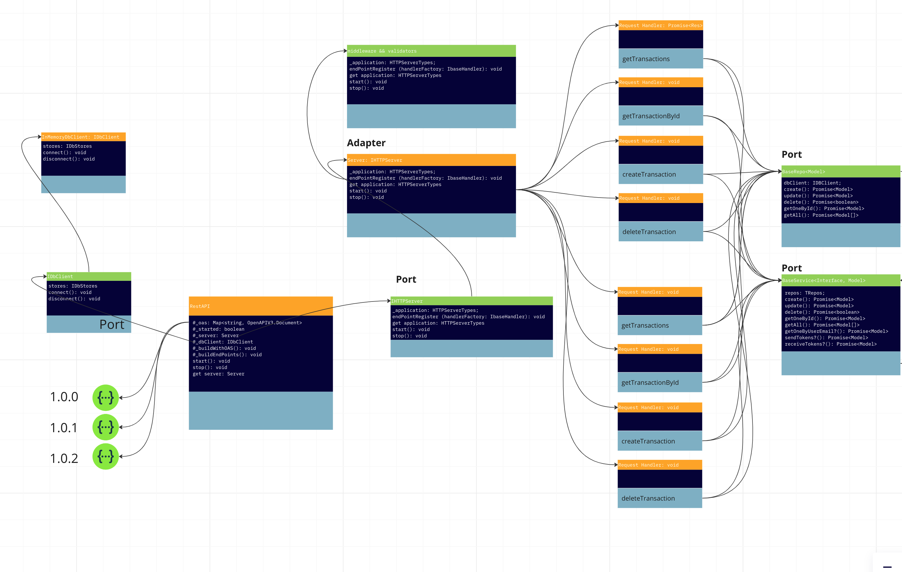

# Run: AnyWhere, AnyHow, AnyTime Typescript Boilertplate

*PROJECT STATUS: IN PROGRESS*

This is a boilerplate to build REST APIs, Monolithic Modular and Microservice applications with Typescript.

The application aims to run `Anywhere, Anytime, Anyhow`. `Dedicated servers`, `virtual machines`, `containers`, `EC2`, `ECS` or `lambdas`, with `Express`, `Fastify`, `Hyper-Express` and `serverless`.

It was built based on a simplistic interpretation of Hexagonal Architecture and the Domain Driven Design philosophy.

It implements concurrency control through a mutex implementation to achieve data consistency between the different domains.

It follows an 100% agnostic approach totally focused on `architecture principles` rather than `vendor based` solutions.

It is being built using TDD techniques since from the scratch. Due the lack of time, actually it just provide test suites for `integration tests`. It actually covers 100% of the end points.

It can be used as boilerplate to create `modular monolith`or `microservice` applications.


### Project features high level overview

It implements incoming data validation, in the infrastructure level, through custom logic and based in the Open API specification.

It implements basic HTTP auth mechanism with a custom role system. Replaceable with other auth mechanisms. Tied to the API OAS spec.

It implements a HTTP web server port actually using an adapter for Express.js. It is easily replaceable with Fastify, Hyper-Express, etc.

It implements an agnostic data repository port that actually writes/reads data from a In Memory database. It is easily replaceable with Mongoose, Sequelize, etc.

Actually it has 1 Domains:

1. Users

```typescript
    interface IUser {
      id: string;
      firstName: string;
      lastName: string;
      avatar: string;
      login: LoginCustomValueObject;
      emails: EmailValueObject[];
      documents?: DocumentValueObject[];
      phones?: PhoneValueObject[];
      roles: string[];
    }
```

`Full implemented Use Cases`:

- *createUser*
- *updateUser*
- *getAllUsers*
- *getUserById*
- *deleteUserById*

### Classes' diagram

Diagram illustrating the components:



https://miro.com/app/board/uXjVNq5nWJY=/?share_link_id=603404471489

### API documentation

The API doc might be visualized at: http://localhost:3000/doc/

***Note:*** Remember to start the application before trying to reach it through the browser.

### Request data workflow through the architecture's components

Request Handler -> Domain Service -> Domain Use Case -> Data Repository -> Data Adapter

### Response data workflow through the architecture's components

Request Handler <- Domain Service <- Domain Use Case <- Data Repository <- Data Adapter

### Main components and their responsibility scope

#### 1.`Request Handlers`

It is the entry point in a request to the service. 

`It is a infrastructure's component.`

It performs params, body, url and access permission validations against the incoming request, using the associated OAS specification for each end point.

It may offers adapters for different outside service interfaces:

- HTTP - Lambdas (AWS, Azure, Google)
- HTTP - Express
- HTTP - Fastify
- HTTP - Hyper-Express
- HTTP - etc
- Events/SQS
- Events/SNS
- Events/etc

#### 2.`Domain Service`

It is the entry point for the application core (domains).

`It is a domain's component.`

May works as aggregation root / bounded contexts talking directly to injected domain services (aka domains and subdomains).

It should be the unique option working as communication interface between `infrastructure` and `domain components`.

It has a dbClient adapter and a mutexClient adapter injected on it instance.

It may lock resources to avoid race conditions by using the injected mutexClient.

It knows it internal domain use cases.

It doesn't knows external domain use cases.

#### 3.`Use Case`

The `Use Cases`, as the meaning of the words, are the use cases implemented in the Product. 

They represents the features delivered to the customers.

`It is a domain's component.` They known and are consumed by the `Domain Service` component only.

They are the point entry for all `Data Repository` calls. They handle `Data Models` rather than raw objects.

They have an associated `Data Repository` that is injected into it scope when calling `Use Case` clojure.

#### 4.`Data Repository`

The `Data Repository` layer implements, in a agnostic manner, all actions related to the data persistency.

It does not talk directly to a database. I has a port to adapt different Database Clients.

`It is a domain's component.` They are consumed by `Use Case` component only.

#### 5.`Data Adapter`

The `Data adapter` is a kind of database client implementation that respect the `Data Repository` port.

It may implement database access through native drivers or ORMs and ODMs.

`It is a domain's component.`

## Required stack

- Node.js (20 preferred)
- Typescript
- Jest
- Redis - used to implement mutex (included as Docker image)
- OpenAPI official typings
- yaml - yaml parser
- Express


## Evaluating the application

1. Install the project

```bash
    npm install
```

2. Run Redis (if you don't have already)

```bash
    npm run docker:composeredis
```

### Run the entire test suite

```bash
    npm test
```

### Run the API - 3000 port

Run with Express

```bash
    npm run dev:fastify
```

Run with Fastify

```bash
    npm run dev:fastify
```

1. Reach the URL http://localhost:3000/doc/ and click in the `Version 1.0.0`. It will open the API documentation.
2. Reach http://localhost:3000/docs/1.0.0 to see the JSON version of the API documentation.


## Contributing to the project

1. Create a new branch.
2. `Run the app in TDD mode - live reload of tests`

```bash
  npm run tdd
```

3. Make your changes.
4. Commit it
5. Ask for PR


### Tooling

`lint code`

```bash
  npm run lint
```

`lint && fix code`

```bash
  npm run lint:fix
```

`commit`

It will run `lint` and `test` before asking info about the commit

```bash
  npm run commit
```

`Commiting code`

Commit messages must follow the [Angular Commit Message Guidelines](https://github.com/angular/angular/blob/22b96b9/CONTRIBUTING.md#-commit-message-guidelines)

It generates a changelog following the [Commitizen conventional changelog](https://commitizen-tools.github.io/commitizen/changelog/)


## Current Backlog

- Turn on following lint rules and fix the code:

```javascript
      'no-underscore-dangle': 'off',
      'import/prefer-default-export': 'off',
      '@typescript-eslint/no-explicit-any': 'off',
      'import/no-cycle' : 'off',
      'arrow-body-style' : 'off',
      'jest/unbound-method': 'off',
```

- Create a `Dead-Letter` queue for transactions rejected when the resource is locked by the mutex
- Implement a ServerSentEvent (EventSource) to notify the client about the execution of the items from the `Dead-Letter` queue.
- Implement dbClient for Mongoose
- Implement dbClient for Sequelize
- Implement dbClient from DynamoDB
- Implement a IKVStore Port and a KVStoreClient Redis adapter to be used with the Mutex and AuthService (JWT implementation)
- Implement JWT tokens and Bearer authorization into existing AuthService
- Implement Custom User Provider and plug to existing AuthService
- Integrate Auth0, Google login with Oauth2
- Unit testing - test suite
- Add filtering and paging to getAll records methods