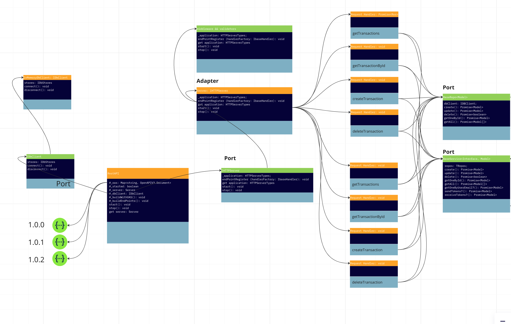
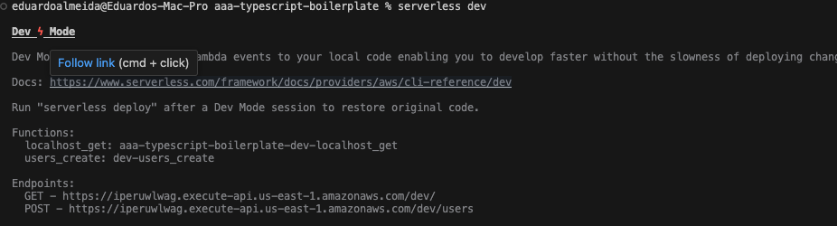

# AnyWhere, AnyHow, AnyTime - Typescript Boilerplate

`The ultimate boilerplate to build REST APIs, Monolithic Modular and Microservice applications with Typescript.`

Applications built with this boilerplate aims to run `Anywhere, Anytime, Anyhow`. `Dedicated servers`, `virtual machines`, `containers`, `EC2`, `ECS` or `lambdas`, with `Express`, `Fastify`, `Hyper-Express` and `serverless`.

| Security scan status | Tests in Main | Tests in Dev | Coverage in Main | Coverage in Dev |
|----------------------|:-------------:|:------------:|:----------------:|----------------:|
|  [](https://snyk.io/test/github/web2solutions/aaa-typescript-boilerplate) | [](https://dl.circleci.com/status-badge/redirect/gh/web2solutions/aaa-typescript-boilerplate/tree/main) | [](https://dl.circleci.com/status-badge/redirect/gh/web2solutions/aaa-typescript-boilerplate/tree/dev) | [](https://codecov.io/gh/web2solutions/aaa-typescript-boilerplate) | [](https://codecov.io/gh/web2solutions/aaa-typescript-boilerplate) |
|   |   |   |   |   |

[](https://vshymanskyy.github.io/StandWithUkraine)  [](https://github.com/prettier/prettier) [](http://commitizen.github.io/cz-cli/) [](https://sonarcloud.io/summary/new_code?id=web2solutions_aaa-typescript-boilerplate) [](https://sonarcloud.io/summary/new_code?id=web2solutions_aaa-typescript-boilerplate) [](https://sonarcloud.io/summary/new_code?id=web2solutions_aaa-typescript-boilerplate) [](https://sonarcloud.io/summary/new_code?id=web2solutions_aaa-typescript-boilerplate) [](https://sonarcloud.io/summary/new_code?id=web2solutions_aaa-typescript-boilerplate) [](https://sonarcloud.io/summary/new_code?id=web2solutions_aaa-typescript-boilerplate) [](https://sonarcloud.io/summary/new_code?id=web2solutions_aaa-typescript-boilerplate) [](https://sonarcloud.io/summary/new_code?id=web2solutions_aaa-typescript-boilerplate) [](https://sonarcloud.io/summary/new_code?id=web2solutions_aaa-typescript-boilerplate)    


`Overall Code Coverage`

[](https://codecov.io/web2solutions/aaa-typescript-boilerplate)

`See it running as a Fastify application at:`

[](https://gitpod.io/#https://github.com/web2solutions/aaa-typescript-boilerplate)

It is built over a simplistic interpretation of Hexagonal Architecture, the Domain Driven Design and Event Driven Architecture philosophies.

It aims to be as much agnostic as possible, avoiding to add any frameworks or libraries to the stack.

It can be used as boilerplate to create `modular monolith`or `microservice` applications.

### Project features high level overview

It implements incoming data validation, in the infrastructure level, through custom logic and based in the Open API specification.

It implements Basic and Bearer HTTP auth mechanism with a custom role system. Replaceable with other auth mechanisms. Tied to the API OAS spec.

It implements a HTTP web server port actually implementing adapters for `aws Lambda`, `Express.js`, `Fastify`, `Restify` and `Hyper-Express`.

It implements an agnostic data repository port that actually writes/reads data from a In Memory database adapter. It is easily replaceable with Mongoose, Sequelize, etc.

### Classes' diagram

Diagram illustrating the components:



<https://miro.com/app/board/uXjVNq5nWJY=/?share_link_id=603404471489>

### API documentation

The API OASdoc might be visualized at: <http://localhost:3000/OASdoc/>

***Note:*** Remember to start the application before trying to reach it through the browser.

### Request data workflow through the architecture's components

Request Handler - Controller - Domain Service - Domain Use Case - Data Repository - Data Adapter

### Response data workflow through the architecture's components

Request Handler <- Controller <- Domain Service <- Domain Use Case <- Data Repository <- Data Adapter

### Main components and their responsibility scope

#### 1.`HTTP Request Handlers`

It is the entry point in a `HTTP` request made to the service.

`It is a infrastructure's component.`

It composes a `Domain Event` using it income parameters such as `body` and `headers`. The domain event is passed to the `Controller` by calling an associated method.

It may offers adapters for different outside service interfaces:

- HTTP - Lambdas (AWS, Azure, Google)
- HTTP - Express
- HTTP - Fastify
- HTTP - Hyper-Express
- HTTP - etc
- Events/SQS
- Events/SNS
- Events/etc

#### 2.`Controllers`

Controllers are responsible to forward the `incoming Domain Events` to their specific corelated method in the `Domain Service`.

`It is a infrastructure's component.`

It performs input data validation and access permission validation against the incoming `Domain Events` using an associated OAS specification

#### 3.`Domain Service`

It is the entry point for the application core (domains).

`It is a domain's component.`

May works as aggregation root / bounded contexts talking directly to injected domain services (aka domains and subdomains).

It should be the unique option working as communication interface between `infrastructure` and `domain components`.

It has a databaseClient adapter and a mutexService adapter injected on it instance.

It may lock resources to avoid race conditions by using the injected mutexService.

It knows it internal domain use cases.

It doesn't knows external domain use cases.

#### 4.`Use Case`

The `Use Cases`, as the meaning of the words, are the use cases implemented in the Product.

They represents the features delivered to the customers.

`It is a domain's component.` They known and are consumed by the `Domain Service` component only.

They are the point entry for all `Data Repository` calls. They handle `Data Models` rather than raw objects.

They have an associated `Data Repository` that is injected into it scope when calling `Use Case` clojure.

#### 5.`Data Repository`

The `Data Repository` layer implements, in a agnostic manner, all actions related to the data persistency.

It does not talk directly to a database. I has a port to adapt different Database Clients.

`It is a domain's component.` They are consumed by `Use Case` component only.

#### 6.`Data Adapter`

The `Data adapter` is a kind of database client implementation that respect the `Data Repository` port.

It may implement database access through native drivers or ORMs and ODMs.

`It is a domain's component.`

## Required stack

- Node.js  (^20 preferred) and pnpm
- Typescript
- Jest
- Redis - used to implement mutex (included as Docker image)
- OpenAPI official typings
- yaml - yaml parser

## Evaluating the application

1. Install the project

```bash
    pnpm install
```

2. Run Redis (if you don't have already)

```bash
    pnpm run docker:composeredis
```

### Testing

`Run the entire test suite`

```bash
    pnpm test
```

`Run unit tests`

```bash
    pnpm run test:unit
```

`Run integration tests`

```bash
    pnpm run test:integration
```

`Run integration tests - Express`

```bash
    pnpm run test:integration:express
```

`Run integration tests - Fastify`

```bash
    pnpm run test:integration:fastify
```

`Run integration tests - Restify`

```bash
    pnpm run test:integration:restify
```

`Run integration tests - aws lambda`

```bash
    pnpm run test:integration:lambda
```

### Run the API - 3000 port

Run with Express

```bash
    pnpm run dev:fastify
```

Run with Fastify

```bash
    pnpm run dev:fastify
```

1. Reach the URL <http://localhost:3000/OASdoc/> and click in the `Version 1.0.0`. It will open the API documentation.
2. Reach <http://localhost:3000/docs/1.0.0> to see the JSON version of the API documentation.

### Run `aws Lambda dev mode` through the `serverless framework`

```bash
  pnpm run dev:serverless
```



## Contributing to the project

1. Create a new branch.
2. `Run the app in TDD mode - live reload of tests`

```bash
  pnpm run tdd
```

3. Make your changes.

4. Commit it

`commit`

It will run `lint` and `test` before asking info about the commit

```bash
  pnpm run commit
```

5. Ask for PR

### Tooling

`lint code`

```bash
  pnpm run lint
```

`lint && fix code`

```bash
  pnpm run lint:fix
```

## Dependencies

### Application

> bcryptjs - ^2.4.3
>
> jsonwebtoken - ^9.0.2
>
> openapi-types - ^12.1.3
>
> reflect-metadata - ^0.2.2
>
> uuid - ^9.0.1
>
> xss - ^1.0.15
>
> yaml - ^2.3.4
>

### Infra - Express server

> express - ^4.18.2
>
> body-parser - ^1.20.2
>
> cors - ^2.8.5
>
> helmet - ^7.1.0
>

### Infra - Fastify server

> fastify - ^4.26.2
>
> @fastify/cors - ^9.0.1
>
> @fastify/formbody - ^7.4.0
>
> @fastify/helmet - ^11.1.1
>
> @fastify/static - ^7.0.1
>

### Infra - Restify

> restify - ^11.1.0
> bunyan - ^1.8.15
>

### Infra - Hyper-Express server

> hyper-express - ^6.14.12
>
> live-directory - ^3.0.3
>

### Infra - aws Lambda - serverless

> aws-lambda - ^1.0.7
>
> serverless - ^4.2.4
>

### Infra - Distributed KeyValue Storage

> redis - ^4.6.13
>

## Backlog and project management

<https://github.com/users/web2solutions/projects/1>
