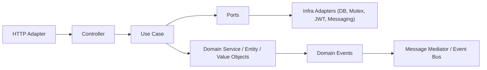

# AnyWhere, AnyHow, AnyTime - TypeScript Boilerplate

Build production-grade backend products faster, with clear architecture, strict quality gates, and runtime freedom.

This project is a feature-driven backend boilerplate for teams that want speed without losing long-term maintainability. It supports monolithic modular systems, microservice-ready composition, and lambda/serverless execution using the same core business logic.

## Why Teams Choose This Boilerplate

### 1) Faster Time to Market
- Core architecture is already structured (DDD + Hexagonal + Event-Driven).
- You start from real domain boundaries, not from generic folders.
- CI quality gates are pre-wired.

### 2) Lower Refactor Cost Over Time
- Business rules are isolated from HTTP frameworks.
- You can switch transport/runtime adapters without rewriting domain/application layers.
- Contract-based message mediator reduces coupling between domains.

### 3) Better Delivery Predictability
- Built-in guardrails for lint, tests, route resolution, architecture boundaries, and coverage threshold.
- Coverage policy is enforced as a release discipline.
- Runtime and docs are aligned by project requirements and agents.

## What You Can Build

- REST APIs with multiple Node.js HTTP frameworks
- Modular monoliths ready to split into microservices
- AWS Lambda handlers from the same domain/application composition
- Contract-based domain communication (in-memory, RabbitMQ, BullMQ)
- Developer automation workflows through the CLI sub-apps

## Available Node.js Web/HTTP Integrations

The project already includes adapters and entrypoints for:

1. Express
2. Fastify
3. Restify
4. Hyper-Express
5. AWS Lambda (Serverless Framework)
6. Cloudflare Workers style adapter (serverless `fetch`)
7. Vercel Functions style adapter (`req`/`res`)
8. LoopBack runtime adapter
9. Sails.js runtime adapter
10. Feathers runtime adapter
11. Derby.js runtime adapter
12. Adonis.js runtime bridge
13. Total.js runtime bridge

## Integration Commands

Run any adapter in development:

```bash
npm run dev:express
npm run dev:fastify
npm run dev:restify
npm run dev:hyper-express
npm run dev:cloudflare-workers
npm run dev:vercel-functions
npm run dev:loopback
npm run dev:sails-js
npm run dev:feathers
npm run dev:derby-js
npm run dev:adonis-js
npm run dev:total-js
npm run dev:serverless
```

Production equivalents are also available (`prod:*` scripts).

## Product and Engineering Benefits

### For Product Owners
- Faster feature delivery with reduced architectural risk.
- Better roadmap confidence from enforced quality checks.
- Easier scaling from MVP to multi-runtime deployment strategies.

### For Software Engineers
- Clear layer ownership:
  - Domain
  - Use Cases
  - Ports
  - Adapters
  - Controllers/Handlers
- Contract-driven integration over direct cross-domain dependency.
- Stable patterns for adding features with minimum blast radius.

## Architecture at a Glance


```mermaid
flowchart LR
  A["HTTP Adapter"] --> B["Controller"]
  B --> C["Use Case"]
  C --> D["Domain Service / Entity / Value Objects"]
  C --> E["Ports"]
  E --> F["Infra Adapters (DB, Mutex, JWT, Messaging)"]
  D --> G["Domain Events"]
  G --> H["Message Mediator / Event Bus"]
```

## Message Mediator (Contract-Based)

Domains communicate through contracts, not direct service coupling.

Supported adapters:
- `inmemory` (default)
- `rabbitmq`
- `bullmq`

Select adapter by environment:

```bash
AAA_MESSAGE_MEDIATOR_ADAPTER=inmemory
# or
AAA_MESSAGE_MEDIATOR_ADAPTER=rabbitmq
# or
AAA_MESSAGE_MEDIATOR_ADAPTER=bullmq
```

## Code Example: Register a Contract Handler

```ts
messageMediator.registerHandler(
  "users.auth.ensure-access",
  async (message) => {
    const user = await authService.authorize(message.payload.authorization);
    authService.throwIfUserHasNoAccessToResource(user, message.payload.schemaOAS);
    return {
      contract: message.contract,
      version: message.version,
      result: user
    };
  }
);
```

## Code Example: Request/Response Without Tight Coupling

```ts
const response = await messageMediator.request({
  contract: "users.auth.ensure-access",
  payload: {
    authorization: event.authorization,
    schemaOAS: event.schemaOAS
  }
});

if (response.error) {
  throw response.error;
}
```

## Code Example: Framework Runtime Bootstrap

```ts
const serverType = EHTTPFrameworks.fastify;
const webServer = FastifyServer.compile();
const messageMediator = compileMessageMediator();

const API = new RestAPI({
  databaseClient: InMemoryDbClient,
  webServer,
  serverType,
  infraHandlers,
  eventBus: messageMediator,
  messageMediator
});

await API.start();
await API.seedData();
```

## Quick Start

```bash
npm install
npm run docker:composeredis
npm run docker:composerabbit
npm run ci:gate
npm run dev:fastify
```

API docs after startup:
- UI: `http://localhost:3000/OASdoc/`
- JSON: `http://localhost:3000/docs/1.0.0`

## Quality Gate and CI Discipline

This project is designed to block risky changes before merge:
- lint
- unit tests
- architecture checks
- OpenAPI route resolution checks
- build check
- smoke integration
- coverage threshold policy

## Documentation Index

| Nature | Document | Description |
|--------|----------|-------------|
| Product Context | [Project Overview](documentation/md/PROJECT-OVERVIEW.md) | Purpose, use cases, acceleration strategy, and product value. |
| Architecture | [Architecture and Structure](documentation/md/ARCHITECTURE-AND-STRUCTURE.md) | Folder structure, boundaries, and layer responsibilities. |
| Runtime and Ops | [Setup, Runtime, and API](documentation/md/SETUP-RUNTIME-AND-API.md) | Setup, commands, runtime adapters, and API docs endpoints. |
| Integration Contracts | [Events and Messages Map](documentation/md/EVENTS-AND-MESSAGES-MAP.md) | Event and mediator contract map. |
| Error Contracts | [Error Contracts and Responses](documentation/md/ERROR-CONTRACTS-AND-RESPONSES.md) | Error codes, mapping, and HTTP response contracts. |
| Quality | [Testing, CI, and Quality](documentation/md/TESTING-CI-AND-QUALITY.md) | Test strategy, CI gate, coverage policy, Sonar/Codecov. |
| Tooling | [Contributing and Tooling](documentation/md/CONTRIBUTING-AND-TOOLING.md) | Development workflow and commands. |
| Dependencies | [Dependencies](documentation/md/DEPENDENCIES.md) | Runtime and infrastructure dependencies. |
| Domain Entities | [Domain Data Entities](documentation/md/DOMAIN-DATA-ENTITIES.md) | Data entity catalog and field contracts. |
| Developer CLI | [Developer Automation CLI](documentation/md/DEVELOPER-AUTOMATION-CLI.md) | CLI wrapper and sub-app workflows. |
| Agents Registry | [.agents/README.md](.agents/README.md) | Technical requirements and specialized agents. |

## Additional Detailed Documents

- [Engineering Bootstrap Guide](documentation/md/ENGINEERING-BOOTSTRAP-GUIDE.md)
- [Hexagonal Feature-driven Migration Plan](documentation/md/HEXAGONAL-FEATURE-DRIVEN-MIGRATION.md)
- [Users Domain Model](documentation/md/domains/users/USER-MODEL.md)
- [Users Entity Contract](documentation/md/domains/users/USER-ENTITY-CONTRACT.md)
- [Users Value Objects](documentation/md/domains/users/USER-VALUE-OBJECTS.md)
- [CI Troubleshooting](documentation/md/CI-TROUBLESHOOTING.md)

---

If you need high delivery speed, multi-runtime flexibility, and architecture control without framework lock-in, this boilerplate is built for your team.
