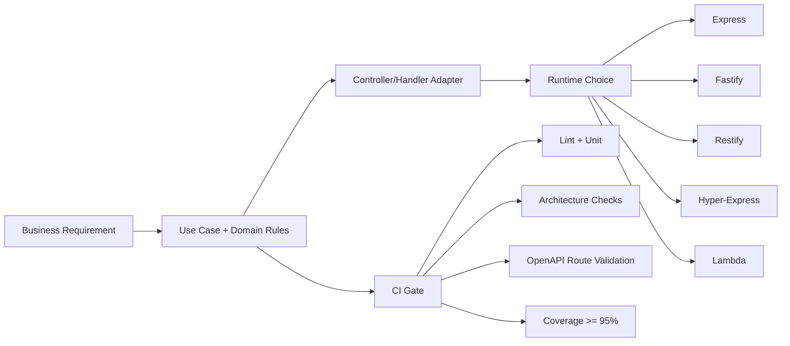
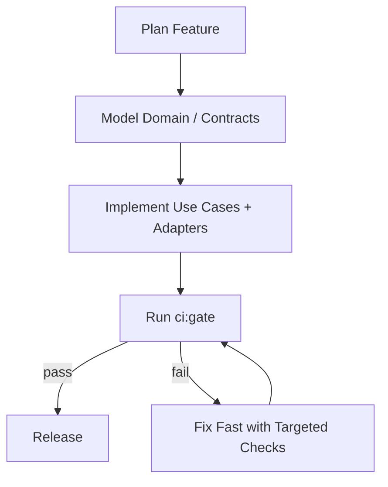

# AnyWhere, AnyHow, AnyTime - TypeScript Boilerplate

`The ultimate boilerplate to build REST APIs, monolithic modular and microservice applications with TypeScript.`

Applications built with this boilerplate aim to run `Anywhere, Anytime, Anyhow`: on `dedicated servers`, `virtual machines`, `containers`, `EC2`, `ECS`, and `lambdas`, using `Express`, `Fastify`, `Restify`, `Hyper-Express`, and `serverless`.

| Security scan status | Tests in Main | Tests in Dev | Coverage in Main | Coverage in Dev |
|----------------------|:-------------:|:------------:|:----------------:|----------------:|
| [](https://snyk.io/test/github/web2solutions/aaa-typescript-boilerplate) | [](https://dl.circleci.com/status-badge/redirect/gh/web2solutions/aaa-typescript-boilerplate/tree/main) | [](https://dl.circleci.com/status-badge/redirect/gh/web2solutions/aaa-typescript-boilerplate/tree/dev) | [](https://codecov.io/gh/web2solutions/aaa-typescript-boilerplate) | [](https://codecov.io/gh/web2solutions/aaa-typescript-boilerplate) |

[](https://expressjs.com/)
[](https://fastify.dev/)
[](http://restify.com/)
[](https://github.com/kartikk221/hyper-express)
[](https://www.serverless.com/)

[](https://sonarcloud.io/summary/new_code?id=web2solutions_aaa-typescript-boilerplate)
[](https://sonarcloud.io/summary/new_code?id=web2solutions_aaa-typescript-boilerplate)
[](https://sonarcloud.io/summary/new_code?id=web2solutions_aaa-typescript-boilerplate)
[](https://sonarcloud.io/summary/new_code?id=web2solutions_aaa-typescript-boilerplate)


[](http://commitizen.github.io/cz-cli/)


[](https://vshymanskyy.github.io/StandWithUkraine)

## Overall Code Coverage

[](https://codecov.io/web2solutions/aaa-typescript-boilerplate)

## See It Running (Fastify)

[](https://gitpod.io/#https://github.com/web2solutions/aaa-typescript-boilerplate)

## Why This Project Exists

Teams need to ship backend products fast without accepting long-term framework lock-in, architecture drift, or fragile delivery pipelines.

This boilerplate gives you:

- framework-level runtime flexibility with stable domain/application boundaries
- strong delivery guardrails (CI gates, coverage policy, architecture checks)
- a path from MVP to microservices/lambda without rewriting business rules

## Who Benefits Most

### For Product Owners

- Faster delivery with lower rework risk.
- Better roadmap predictability due to architecture and CI guardrails.
- Clear support for modular monolith, microservice, and lambda operating models.
- Easier team scaling through conventions and standard workflows.

### For Software Engineers

- Hexagonal + DDD + Event-driven baseline already structured.
- Strong separation of concerns: handlers, controllers, use cases, domain, ports, adapters.
- Multi-runtime HTTP support without domain rewrites.
- Enforced quality gates (lint, unit, architecture checks, route resolution, smoke, coverage).

## Message Mediator and Domain Workers

- Domains integrate through contract-based messaging, not direct cross-domain service coupling.
- The mediator adapter is runtime-selectable:
  - `inmemory` (default)
  - `rabbitmq`
  - `bullmq`
- This keeps domain communication stable when moving from modular monolith to distributed workers/microservices.
- Configuration details are documented in [Setup, Runtime, and API](docs/SETUP-RUNTIME-AND-API.md#message-mediator-adapter).

## Strategic Advantages Against Highly Opinionated Backends

Without naming competitors, this project is designed for teams that want less framework ceremony and more architectural control.

| Decision Dimension | This Boilerplate | Highly Opinionated, Container-First Backends |
|---|---|---|
| Runtime portability | Native support for multiple HTTP adapters + lambda style composition | Usually optimized around one primary runtime style |
| Core architecture ownership | Domain/application boundaries are explicit and framework-agnostic | Framework patterns can dominate core module design |
| Migration path | Modular monolith -> microservices/lambda with lower refactor pressure | Often requires framework-aligned refactors at scale transitions |
| Dependency model | Prefer ports/events and explicit composition roots | Heavy DI/container usage as default architectural center |
| Change blast radius | Feature-driven boundaries + architecture checks reduce coupling drift | Coupling risk rises when framework modules become integration hubs |
| Delivery quality | CI gate with architecture + OAS + coverage standards built-in | Quality standards vary and are often team-defined from scratch |

## Product Value at a Glance


```mermaid
flowchart LR
  A[Business Requirement] --> B[Use Case + Domain Rules]
  B --> C[Controller/Handler Adapter]
  C --> D[Runtime Choice]
  D --> D1[Express]
  D --> D2[Fastify]
  D --> D3[Restify]
  D --> D4[Hyper-Express]
  D --> D5[Lambda]
  B --> E[CI Gate]
  E --> E1[Lint + Unit]
  E --> E2[Architecture Checks]
  E --> E3[OpenAPI Route Validation]
  E --> E4[Coverage >= 95%]
```

## Delivery Model and Risk Control


```mermaid
flowchart TD
  P[Plan Feature] --> M[Model Domain / Contracts]
  M --> I[Implement Use Cases + Adapters]
  I --> Q[Run ci:gate]
  Q -->|pass| R[Release]
  Q -->|fail| F[Fix Fast with Targeted Checks]
  F --> Q
```

## Documentation Glossary Index

Project documentation is separated by nature so Product and Engineering audiences can navigate quickly:

| Nature | Document | Description |
|--------|----------|-------------|
| Product Context | [Project Overview](docs/PROJECT-OVERVIEW.md) | Purpose, advantages, use cases, acceleration strategy, and AI + Moon Modeler integration. |
| Architecture | [Architecture and Structure](docs/ARCHITECTURE-AND-STRUCTURE.md) | Folder structure, target architecture direction, boundaries, and layer responsibilities. |
| Runtime and Operations | [Setup, Runtime, and API](docs/SETUP-RUNTIME-AND-API.md) | Stack requirements, local setup, API docs endpoints, runtime commands, and production commands. |
| Developer Tooling | [Developer Automation CLI](docs/DEVELOPER-AUTOMATION-CLI.md) | Interactive CLI wrapper to manage domains, entities/models, and field contracts. |
| Messaging and Worker Pattern | [Setup, Runtime, and API](docs/SETUP-RUNTIME-AND-API.md#message-mediator-adapter) | `MessageMediator` adapter selection (`inmemory` / `rabbitmq` / `bullmq`) and broker runtime configuration. |
| Quality and Delivery | [Testing, CI, and Quality](docs/TESTING-CI-AND-QUALITY.md) | Testing commands, CI gate, coverage policy, Sonar/Codecov, Node 22 enforcement, and CI troubleshooting links. |
| Engineering Workflow | [Contributing and Tooling](docs/CONTRIBUTING-AND-TOOLING.md) | Contribution workflow and all key local engineering commands. |
| Dependencies | [Dependencies](docs/DEPENDENCIES.md) | Dependency breakdown by application and infrastructure runtime. |
| Project Management | [Project Management](docs/PROJECT-MANAGEMENT.md) | Backlog/project board reference. |

## Quick Start

```bash
npm install
npm run docker:composeredis
npm run docker:composerabbit
npm run ci:gate
npm run dev:fastify
```

## Developer Automation CLI

Run the wrapper CLI:

```bash
npm run cli
npm run dev:cli
npm run start:cli
```

Initial sub applications:

1. Domains CRUD manager (list/search/create/update/delete domains)
2. Data Entities and Models CRUD manager (list/search/create/update/delete and advanced field management with details + behavior editing)

CLI catalog is persisted at:

- `.aaa-cli/workspace-catalog.json`

## Additional Detailed Documents

- [Engineering Bootstrap Guide](docs/ENGINEERING-BOOTSTRAP-GUIDE.md)
- [Hexagonal Feature-driven Migration Plan](docs/HEXAGONAL-FEATURE-DRIVEN-MIGRATION.md)
- [Domain Data Entities](docs/DOMAIN-DATA-ENTITIES.md)
- [Users Domain Model](docs/domains/users/USER-MODEL.md)
- [Users Entity Contract](docs/domains/users/USER-ENTITY-CONTRACT.md)
- [Users Value Objects](docs/domains/users/USER-VALUE-OBJECTS.md)
- [CI / SonarQube / Codecov Troubleshooting](docs/CI-TROUBLESHOOTING.md)
- [Developer Automation CLI](docs/DEVELOPER-AUTOMATION-CLI.md)
- [Agents Requirements Registry](.agents/README.md)
