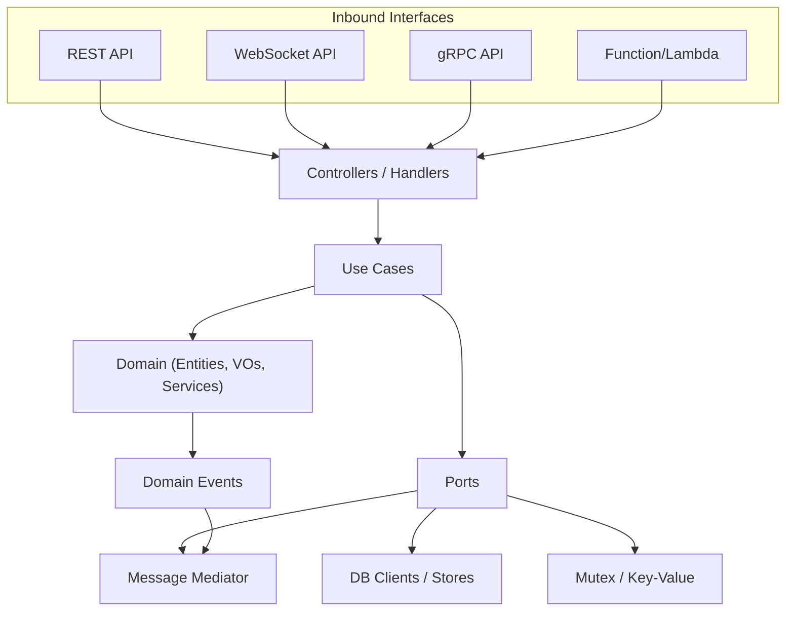
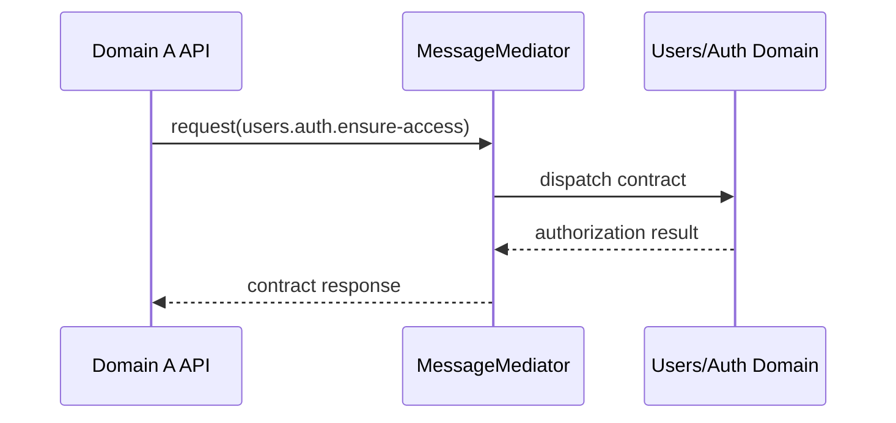
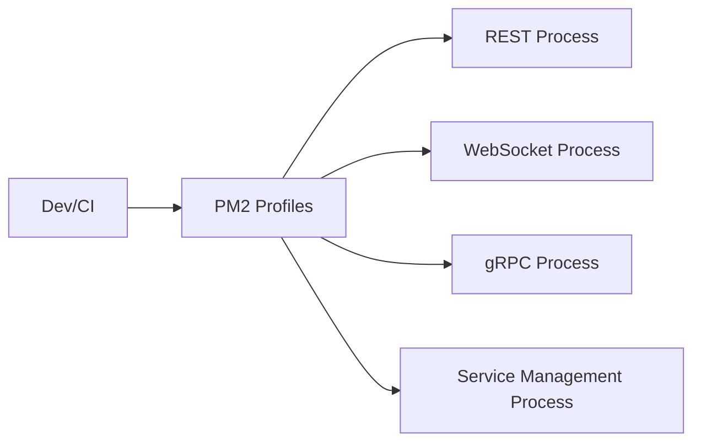

# AnyWhere, AnyHow, AnyTime - TypeScript Boilerplate

[](https://dl.circleci.com/status-badge/redirect/gh/web2solutions/aaa-typescript-boilerplate/tree/dev)
[](https://codecov.io/gh/web2solutions/aaa-typescript-boilerplate)
[](https://sonarcloud.io/summary/new_code?id=web2solutions_aaa-typescript-boilerplate)
[](https://sonarcloud.io/summary/new_code?id=web2solutions_aaa-typescript-boilerplate)
[](https://snyk.io/test/github/web2solutions/aaa-typescript-boilerplate)
[](https://nodejs.org/)
[](./spec/1.0.0.yml)
[](./spec)
[](./LICENSE)
[](https://github.com/web2solutions/aaa-typescript-boilerplate/commits/dev)

| Security scan status | Tests in Main | Tests in Dev | Coverage in Main | Coverage in Dev |
|----------------------|:-------------:|:------------:|:----------------:|----------------:|
| [](https://snyk.io/test/github/web2solutions/aaa-typescript-boilerplate) | [](https://dl.circleci.com/status-badge/redirect/gh/web2solutions/aaa-typescript-boilerplate/tree/main) | [](https://dl.circleci.com/status-badge/redirect/gh/web2solutions/aaa-typescript-boilerplate/tree/dev) | [](https://codecov.io/gh/web2solutions/aaa-typescript-boilerplate) | [](https://codecov.io/gh/web2solutions/aaa-typescript-boilerplate) |

[](https://expressjs.com/)
[](https://fastify.dev/)
[](http://restify.com/)
[](https://github.com/kartikk221/hyper-express)
[](https://www.serverless.com/)

[](https://sonarcloud.io/summary/new_code?id=web2solutions_aaa-typescript-boilerplate)
[](https://sonarcloud.io/summary/new_code?id=web2solutions_aaa-typescript-boilerplate)
[](https://sonarcloud.io/summary/new_code?id=web2solutions_aaa-typescript-boilerplate)


[](http://commitizen.github.io/cz-cli/)

[](https://vshymanskyy.github.io/StandWithUkraine)
[](https://gitpod.io/#https://github.com/web2solutions/aaa-typescript-boilerplate)

Enterprise-grade TypeScript backend platform to build APIs, real-time services, and serverless systems with architecture guardrails, runtime flexibility, and compliance-oriented delivery discipline.

## Executive Summary

This boilerplate is built for teams that need:

- predictable enterprise delivery
- multi-runtime deployment options
- decoupled domain communication
- CI/security/compliance controls by default
- reusable foundations for multiple products

It is not a demo starter. It is a production foundation.

## Enterprise Value Proposition

| Business Driver | Outcome with this Boilerplate |
|-----------------|-------------------------------|
| Time-to-market pressure | Pre-wired architecture + tooling shortens project bootstrap |
| Portfolio standardization | One platform pattern for REST, WebSocket, gRPC, functions |
| Scaling uncertainty | Modular monolith now, microservices later without core rewrite |
| Compliance expectations | Security runbooks, CI gates, audit-oriented artifacts included |
| Cost of change | Ports/adapters isolate framework and infrastructure churn |

## Platform Capabilities

### Architecture

- Domain-Driven Design (DDD)
- Hexagonal architecture (ports/adapters)
- Event-driven design
- Feature-driven modular boundaries
- Contract-first integration model

### Interfaces and Runtime Modes

- REST API
- WebSocket API (+ REST fallback)
- gRPC API (+ REST fallback)
- Function/Lambda style adapters
- PM2 profile orchestration for VM deployments

### Service Communication

- `MessageMediator` request/response + pub/sub support
- Adapters:
  - `inmemory`
  - `rabbitmq`
  - `bullmq`
- Contract-based handlers to avoid direct cross-domain coupling

### Security and Compliance Baseline

- Multi-tenant RBAC controls (`superadmin`, `admin`, `user`)
- Organization scope boundaries
- Environment-aware error detail policy
- PCI-oriented remediation/evidence documentation
- CI security smoke checks

### Developer Productivity

- CLI scaffold (`aaa-bootstrap` / `jumentix-init`)
- Developer automation CLI
- Service Management application with Domain Designer
- Contract/schema exporters (OpenAPI/AsyncAPI/JSON Schema/etc.)

## Feature Matrix (Technical)

| Capability Group | Implemented Features |
|------------------|----------------------|
| Domain Modeling | Entities, value objects, relationships, aggregate/invariants, bounded context metadata |
| Relationship UX | Anchor drag connectors, pick mode, reverse relation, bend controls, routing mode, label offsets |
| Policy Modeling | RBAC mapping per entity/action + tenant scope |
| Contract Modeling | Event/command/request/response contracts with payload schema editor |
| OpenAPI Controls | `oneOf`/`allOf`/`anyOf`, external refs, discriminator |
| Model Governance | Model checks with severity levels + export quality gate |
| Diff and Migration | Baseline save/clear + schema diff hints |
| Generation | Request/response examples + code skeleton preview |
| Export/Import | JSON, OpenAPI 3.1, Markdown, JSON Schema, AsyncAPI, package, boilerplate bundle |
| Large Model UX | Mini-map + large-canvas performance mode |

## Adapter Coverage

### HTTP/Runtime Adapters

1. Express
2. Fastify
3. Restify
4. Hyper-Express
5. AWS Lambda (Serverless)
6. Cloudflare Workers style adapter
7. Vercel Functions style adapter
8. LoopBack runtime adapter
9. Sails.js runtime adapter
10. Feathers runtime adapter
11. Derby.js runtime adapter
12. Adonis.js runtime bridge
13. Total.js runtime bridge

## Adapter Code Examples (HTTP Frameworks)

Below are practical examples you can reuse as starting points for each HTTP adapter.

### Express

```ts
import { ExpressServer } from "@src/interface/HTTP/adapters/express/ExpressServer";
import { RestAPI } from "@src/interface/HTTP/RestAPI";
import { EHTTPFrameworks } from "@src/interface/HTTP/ports";

const webServer = ExpressServer.compile();
const api = new RestAPI({
  serverType: EHTTPFrameworks.express,
  webServer
});

await api.start();
```

### Fastify

```ts
import { FastifyServer } from "@src/interface/HTTP/adapters/fastify/FastifyServer";
import { RestAPI } from "@src/interface/HTTP/RestAPI";
import { EHTTPFrameworks } from "@src/interface/HTTP/ports";

const webServer = FastifyServer.compile();
const api = new RestAPI({
  serverType: EHTTPFrameworks.fastify,
  webServer
});

await api.start();
```

### Restify

```ts
import { RestifyServer } from "@src/interface/HTTP/adapters/restify/RestifyServer";
import { RestAPI } from "@src/interface/HTTP/RestAPI";
import { EHTTPFrameworks } from "@src/interface/HTTP/ports";

const webServer = RestifyServer.compile();
const api = new RestAPI({
  serverType: EHTTPFrameworks.restify,
  webServer
});

await api.start();
```

### Hyper-Express

```ts
import { HyperExpressServer } from "@src/interface/HTTP/adapters/hyper-express/HyperExpressServer";
import { RestAPI } from "@src/interface/HTTP/RestAPI";
import { EHTTPFrameworks } from "@src/interface/HTTP/ports";

const webServer = HyperExpressServer.compile();
const api = new RestAPI({
  serverType: EHTTPFrameworks.hyperExpress,
  webServer
});

await api.start();
```

### Cloudflare Workers Style

```ts
import cloudflareWorkerHandler from "@src/interface/HTTP/adapters/cloudflare-workers/cloudflare-workers";

export default {
  fetch: (request: Request, env: unknown, ctx: ExecutionContext) =>
    cloudflareWorkerHandler.fetch(request, env, ctx)
};
```

### Vercel Functions Style

```ts
import vercelHandler from "@src/interface/HTTP/adapters/vercel-functions/vercel-functions";

export default async function handler(req: any, res: any) {
  return vercelHandler(req, res);
}
```

### LoopBack Runtime Adapter

```bash
AAA_HTTP_FRAMEWORK=loopback node -r ts-node/register -r tsconfig-paths/register ./src/interface/HTTP/adapters/start-rest-api.ts
```

### Sails.js Runtime Adapter

```bash
AAA_HTTP_FRAMEWORK=sails-js node -r ts-node/register -r tsconfig-paths/register ./src/interface/HTTP/adapters/start-rest-api.ts
```

### Feathers Runtime Adapter

```bash
AAA_HTTP_FRAMEWORK=feathers node -r ts-node/register -r tsconfig-paths/register ./src/interface/HTTP/adapters/start-rest-api.ts
```

### Derby.js Runtime Adapter

```bash
AAA_HTTP_FRAMEWORK=derby-js node -r ts-node/register -r tsconfig-paths/register ./src/interface/HTTP/adapters/start-rest-api.ts
```

### Adonis.js Runtime Bridge

```bash
AAA_HTTP_FRAMEWORK=adonis-js node -r ts-node/register -r tsconfig-paths/register ./src/interface/HTTP/adapters/start-rest-api.ts
```

### Total.js Runtime Bridge

```bash
AAA_HTTP_FRAMEWORK=total-js node -r ts-node/register -r tsconfig-paths/register ./src/interface/HTTP/adapters/start-rest-api.ts
```

### AWS Lambda Handler Example

```ts
import type { APIGatewayProxyEvent, Context } from "aws-lambda";
import createHandler from "@src/interface/aws/lambda/handlers/create";

export async function handler(event: APIGatewayProxyEvent, context: Context) {
  return createHandler(event, context);
}
```

### Database Technology Coverage

| Type | Technologies |
|------|---------------|
| Relational | PostgreSQL, MySQL, SQL Server, Oracle, SQLite |
| Document/NoSQL | MongoDB |
| Key-Value/NoSQL | DynamoDB, Firebase |
| Wide-column | Cassandra |
| Cloud data targets | Aurora, RDS integration paths |
| Official baseline adapter | InMemory |

## Architecture Illustration


```mermaid
flowchart TB
  subgraph "Inbound Interfaces"
    REST["REST API"]
    WS["WebSocket API"]
    GRPC["gRPC API"]
    FN["Function/Lambda"]
  end

  REST --> CTRL["Controllers / Handlers"]
  WS --> CTRL
  GRPC --> CTRL
  FN --> CTRL

  CTRL --> UC["Use Cases"]
  UC --> DOMAIN["Domain (Entities, VOs, Services)"]
  UC --> PORTS["Ports"]

  PORTS --> DB["DB Clients / Stores"]
  PORTS --> KVS["Mutex / Key-Value"]
  PORTS --> MED["Message Mediator"]
  DOMAIN --> EVENTS["Domain Events"]
  EVENTS --> MED
```

## Service Communication Illustration


```mermaid
sequenceDiagram
  participant API as Domain A API
  participant MED as MessageMediator
  participant AUTH as Users/Auth Domain

  API->>MED: request(users.auth.ensure-access)
  MED->>AUTH: dispatch contract
  AUTH-->>MED: authorization result
  MED-->>API: contract response
```

## Runtime and Deployment Illustration


```mermaid
flowchart LR
  DEV["Dev/CI"] --> PM2["PM2 Profiles"]
  PM2 --> R["REST Process"]
  PM2 --> W["WebSocket Process"]
  PM2 --> G["gRPC Process"]
  PM2 --> SM["Service Management Process"]
```

## Key Runtime Environment Contracts

```bash
AAA_HTTP_FRAMEWORK=express
AAA_REALTIME_API=yes
AAA_REALTIME_API_PROTOCOL=websocket
AAA_REALTIME_API_DATABASE_DRIVER=Mongo
AAA_MESSAGE_MEDIATOR_ADAPTER=inmemory
```

## Quick Start

```bash
npm install
npm run cli:bootstrap
npm run ci:gate
npm run dev
```

Optional local infrastructure:

```bash
npm run docker:composeredis
npm run docker:composemessaging
npm run docker:compose:platform-services
```

## API and Contract Docs Endpoints

- OpenAPI UI: `http://localhost:3000/OASdoc/`
- OpenAPI JSON: `http://localhost:3000/docs/1.0.0`
- AsyncAPI UI: `http://localhost:3000/AsyncAPIdoc/`
- AsyncAPI versions: `http://localhost:3000/docs/asyncapi/versions`

## Quality Gate and Delivery Discipline

The standard CI gate enforces:

- lint
- unit tests
- architecture checks
- OAS route-resolution checks
- build
- smoke checks
- coverage threshold policy

Command:

```bash
npm run ci:gate
```

## JumentiX Monorepo Snapshot

The repository already contains the initial `pnpm` workspace structure for JumentiX productization:

- `apps/backend-template`
- `apps/service-management`
- `packages/cli-init`
- `packages/message-mediator`
- `packages/key-value-storage`
- `packages/persistence-contracts`
- `packages/mutex-service`
- `packages/external-persistence-core`
- `packages/external-store-proxy`
- `packages/external-db-repositories`
- `packages/database-client-factory`
- `packages/runtime-infra`
- `packages/adapter-runtime-bootstrap`
- `packages/sdk-rest-client`
- `packages/sdk-websocket-client`
- `packages/sdk-grpc-client`

Migration progress and wave-by-wave acceptance criteria are tracked in [JumentiX Monorepo Execution Plan](documentation/md/JUMENTIX-MONOREPO-EXECUTION-PLAN.md) and [.agents/project-todos.md](.agents/project-todos.md).

## Documentation Index

| Nature | Document | Description |
|--------|----------|-------------|
| Product Context | [Project Overview](documentation/md/PROJECT-OVERVIEW.md) | Purpose, use cases, acceleration strategy, and product value. |
| Architecture | [Architecture and Structure](documentation/md/ARCHITECTURE-AND-STRUCTURE.md) | Folder structure, boundaries, and layer responsibilities. |
| Runtime and Ops | [Setup, Runtime, and API](documentation/md/SETUP-RUNTIME-AND-API.md) | Setup, commands, runtime adapters, and API docs endpoints. |
| Runtime Contract | [Runtime Environment Contracts](documentation/md/RUNTIME-ENVIRONMENT-CONTRACTS.md) | Canonical env keys, startup entrypoints, PM2 process model, and Service Management env API. |
| Integration Contracts | [Events and Messages Map](documentation/md/EVENTS-AND-MESSAGES-MAP.md) | Event and mediator contract map. |
| Error Contracts | [Error Contracts and Responses](documentation/md/ERROR-CONTRACTS-AND-RESPONSES.md) | Error codes, mapping, and HTTP response contracts. |
| Quality | [Testing, CI, and Quality](documentation/md/TESTING-CI-AND-QUALITY.md) | Test strategy, CI gate, coverage policy, Sonar/Codecov. |
| Realtime Quality | [Realtime API Testing](documentation/md/REALTIME-API-TESTING.md) | Unit, integration, and smoke matrix for WebSocket and gRPC APIs. |
| Tooling | [Contributing and Tooling](documentation/md/CONTRIBUTING-AND-TOOLING.md) | Development workflow and commands. |
| Dependencies | [Dependencies](documentation/md/DEPENDENCIES.md) | Runtime and infrastructure dependencies. |
| Domain Entities | [Domain Data Entities](documentation/md/DOMAIN-DATA-ENTITIES.md) | Data entity catalog and field contracts. |
| Developer CLI | [Developer Automation CLI](documentation/md/DEVELOPER-AUTOMATION-CLI.md) | CLI wrapper and sub-app workflows. |
| Bootstrap CLI | [Bootstrap CLI Scaffolding](documentation/md/BOOTSTRAP-CLI-SCAFFOLDING.md) | Installable scaffold command to clone and configure new projects. |
| Service Management | [Service Management App](servicemangement/README.md) | Tabbed suite for domain design, communication interfaces, service configuration, and deploy management. |
| Domain Designer Guide | [Domain Designer Features and Usage](documentation/md/DOMAIN-DESIGNER-FEATURES-AND-USAGE.md) | Technical usage guide for all Domain Designer MVP features and exports/imports. |
| HTTP Adapter Docs | [HTTP Adapters Index](documentation/md/adapters/http/README.md) | Per-adapter implementation and service build guides for all HTTP interfaces. |
| Realtime Adapter Docs | [WebSocket Realtime API](documentation/md/adapters/realtime/WEBSOCKET-API.md) | Focused guide to consume Socket.IO realtime API with request/response message patterns. |
| Realtime Adapter Docs | [gRPC Realtime API](documentation/md/adapters/realtime/GRPC-API.md) | Focused guide to consume gRPC realtime API with unary and streaming contracts. |
| Realtime Contracts | [WebSocket Realtime Contracts](documentation/md/contracts/WEBSOCKET-REALTIME-CONTRACTS.md) | Canonical Socket.IO channel and envelope contracts. |
| Realtime Contracts | [gRPC Realtime Contracts](documentation/md/contracts/GRPC-REALTIME-CONTRACTS.md) | Canonical gRPC service, message, and serialization contracts. |
| Database Adapter Docs | [Database Adapters Index](documentation/md/adapters/databases/README.md) | Per-database setup and service build guides for all supported DB technologies. |
| External Adapters | [External Data Adapter Foundations](documentation/md/EXTERNAL-DATA-ADAPTER-FOUNDATIONS.md) | SQL/NoSQL repository foundations and queue request-response adapter. |
| Database Validation | [Database Drivers Smoke Tests](documentation/md/DATABASE-DRIVERS-SMOKE-TESTS.md) | Driver matrix, per-database Docker compose, and smoke execution commands. |
| Security Compliance | [PCI Remediation Plan and Evidence](documentation/md/PCI-REMEDIATION-PLAN-AND-EVIDENCE.md) | Sprint-based remediation plan (P0/P1/P2) and audit evidence checklist. |
| Security Operations | [Security Runbook (PCI)](documentation/md/SECURITY-RUNBOOK-PCI.md) | Key rotation, incident response, retention and audit export procedures. |
| Domain Designer Roadmap | [Domain Designer MVP Roadmap](documentation/md/DOMAIN-DESIGNER-MVP-ROADMAP.md) | MVP status and future enhancements. |
| JumentiX Monorepo Plan | [JumentiX Monorepo Execution Plan](documentation/md/JUMENTIX-MONOREPO-EXECUTION-PLAN.md) | Wave-based migration plan to pnpm monorepo product structure. |
| JumentiX Packages | [JumentiX Workspace Packages](documentation/md/JUMENTIX-WORKSPACE-PACKAGES.md) | Current workspace package catalog and migration ownership map. |
| JumentiX Wave 5 Cutover | [Wave 5 App Re-homing Cutover](documentation/md/JUMENTIX-WAVE5-APP-REHOMING-CUTOVER.md) | Step-by-step operational cutover guide for app re-homing into workspace apps. |
| JumentiX Wave 5 Path Map | [Wave 5 Path Delta Map](documentation/md/JUMENTIX-WAVE5-PATH-DELTA-MAP.md) | Exact path rewrite map for scripts, PM2, and docs during app re-homing. |
| JumentiX Migration Inventory | [Migration Inventory and Rollback](documentation/md/JUMENTIX-MIGRATION-INVENTORY-AND-ROLLBACK.md) | Current-to-target mapping, wave guardrails, and rollback/tag strategy. |
| JumentiX Governance | [Jumentix Project Governance](documentation/md/JUMENTIX-PROJECT-GOVERNANCE.md) | Official single source of truth policy using GitHub Project `Jumentix`. |
| SDK Migration | [SDK Compatibility Bridge](documentation/md/SDK-COMPATIBILITY-BRIDGE.md) | Transitional contract between legacy `sdk-clients/*` and new `@jumentix/sdk-*` packages. |
| Project Management | [Project Management](documentation/md/PROJECT-MANAGEMENT.md) | Backlog references, requirement tracking, and governance links. |
| Agents Registry | [.agents/README.md](.agents/README.md) | Technical requirements and specialized agents. |

## Additional Detailed Documents

- [Engineering Bootstrap Guide](documentation/md/ENGINEERING-BOOTSTRAP-GUIDE.md)
- [Hexagonal Feature-driven Migration Plan](documentation/md/HEXAGONAL-FEATURE-DRIVEN-MIGRATION.md)
- [Users Domain Model](documentation/md/domains/users/USER-MODEL.md)
- [Users Entity Contract](documentation/md/domains/users/USER-ENTITY-CONTRACT.md)
- [Users Value Objects](documentation/md/domains/users/USER-VALUE-OBJECTS.md)
- [Users Organization Model](documentation/md/domains/users/ORGANIZATION-MODEL.md)
- [CI Troubleshooting](documentation/md/CI-TROUBLESHOOTING.md)
- [Service Management Application](documentation/md/SERVICE-MANAGEMENT-APPLICATION.md)
- [Domain Designer Features and Usage](documentation/md/DOMAIN-DESIGNER-FEATURES-AND-USAGE.md)
- [HTTP Adapters Index](documentation/md/adapters/http/README.md)
- [WebSocket Realtime API](documentation/md/adapters/realtime/WEBSOCKET-API.md)
- [gRPC Realtime API](documentation/md/adapters/realtime/GRPC-API.md)
- [WebSocket Realtime Contracts](documentation/md/contracts/WEBSOCKET-REALTIME-CONTRACTS.md)
- [gRPC Realtime Contracts](documentation/md/contracts/GRPC-REALTIME-CONTRACTS.md)
- [Realtime API Testing](documentation/md/REALTIME-API-TESTING.md)
- [Database Adapters Index](documentation/md/adapters/databases/README.md)
- [Security Runbook (PCI)](documentation/md/SECURITY-RUNBOOK-PCI.md)
- [JumentiX Monorepo Execution Plan](documentation/md/JUMENTIX-MONOREPO-EXECUTION-PLAN.md)
- [JumentiX Workspace Packages](documentation/md/JUMENTIX-WORKSPACE-PACKAGES.md)
- [Wave 5 App Re-homing Cutover](documentation/md/JUMENTIX-WAVE5-APP-REHOMING-CUTOVER.md)
- [Wave 5 Path Delta Map](documentation/md/JUMENTIX-WAVE5-PATH-DELTA-MAP.md)
- [Migration Inventory and Rollback](documentation/md/JUMENTIX-MIGRATION-INVENTORY-AND-ROLLBACK.md)
- [Jumentix Project Governance](documentation/md/JUMENTIX-PROJECT-GOVERNANCE.md)
- [SDK Compatibility Bridge](documentation/md/SDK-COMPATIBILITY-BRIDGE.md)
- [Realtime API Testing](documentation/md/REALTIME-API-TESTING.md)

---

If your goal is to standardize enterprise backend delivery with architecture discipline, runtime flexibility, and commercial-grade platform capabilities, this boilerplate is ready to be your product foundation.
