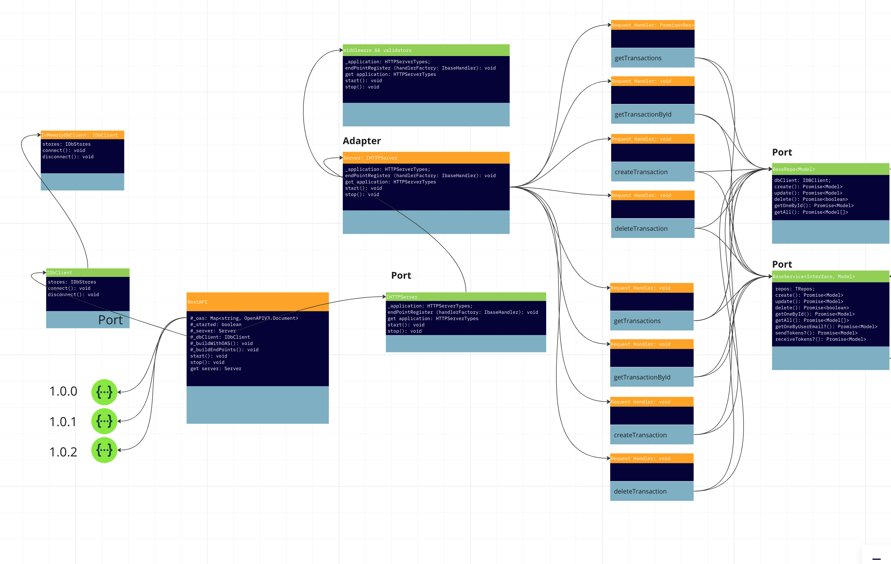

# AnyWhere, AnyHow, AnyTime - TypeScript Boilerplate

`The ultimate boilerplate to build REST APIs, monolithic modular and microservice applications with TypeScript.`

Applications built with this boilerplate aim to run `Anywhere, Anytime, Anyhow`: on `dedicated servers`, `virtual machines`, `containers`, `EC2`, `ECS`, and `lambdas`, using `Express`, `Fastify`, `Restify`, `Hyper-Express`, and `serverless`.

| Security scan status | Tests in Main | Tests in Dev | Coverage in Main | Coverage in Dev |
|----------------------|:-------------:|:------------:|:----------------:|----------------:|
| [](https://snyk.io/test/github/web2solutions/aaa-typescript-boilerplate) | [](https://dl.circleci.com/status-badge/redirect/gh/web2solutions/aaa-typescript-boilerplate/tree/main) | [](https://dl.circleci.com/status-badge/redirect/gh/web2solutions/aaa-typescript-boilerplate/tree/dev) | [](https://codecov.io/gh/web2solutions/aaa-typescript-boilerplate) | [](https://codecov.io/gh/web2solutions/aaa-typescript-boilerplate) |

[](https://expressjs.com/)
[](https://fastify.dev/)
[](http://restify.com/)
[](https://github.com/kartikk221/hyper-express)
[](https://www.serverless.com/)

[](https://sonarcloud.io/summary/new_code?id=web2solutions_aaa-typescript-boilerplate)
[](https://sonarcloud.io/summary/new_code?id=web2solutions_aaa-typescript-boilerplate)
[](https://sonarcloud.io/summary/new_code?id=web2solutions_aaa-typescript-boilerplate)
[](https://sonarcloud.io/summary/new_code?id=web2solutions_aaa-typescript-boilerplate)


[](http://commitizen.github.io/cz-cli/)


[](https://vshymanskyy.github.io/StandWithUkraine)

## Overall Code Coverage

[](https://codecov.io/web2solutions/aaa-typescript-boilerplate)

## See It Running (Fastify)

[](https://gitpod.io/#https://github.com/web2solutions/aaa-typescript-boilerplate)

## Purpose of This Project

This boilerplate provides a production-oriented starting point for backend teams that need to ship quickly without sacrificing architecture quality.

It is built on a pragmatic interpretation of:

- Hexagonal Architecture
- Domain Driven Design (DDD)
- Event Driven Architecture (EDA)

It aims to stay framework-agnostic at the core and can be used for:

- modular monoliths
- microservices
- lambda-first services

## Advantages and Example Applications

### Why this boilerplate is useful

1. Architectural consistency:
   teams start with clear boundaries (handlers, controllers, application use cases, services, repositories, adapters) instead of inventing structure per project.
2. Runtime flexibility:
   the same domain can run with Express/Fastify/Restify/Hyper-Express or Lambda.
3. Easier evolution:
   projects can start as modular monolith and split later with lower refactor cost.
4. Quality baseline:
   lint, tests, OpenAPI checks, route resolution checks, and CI gate are built-in.
5. Better onboarding:
   engineers follow existing conventions and guardrails from day one.

### Example applications

- User and identity services (registration, login, authorization, profile lifecycle).
- Billing/subscriptions APIs with domain policies and events.
- Internal backoffice APIs with strict OpenAPI contract validation.
- Event-driven services exposing operational HTTP endpoints.
- Hybrid API/Lambda workloads sharing the same domain logic.

## How This Project Accelerates New Application Development

- Architecture is already defined and evolving with explicit guardrails.
- Adapter strategy is ready, so runtime switching is incremental.
- Auth/validation/OpenAPI workflows are standardized.
- Repository abstractions allow in-memory start and later DB migration.
- CI checks block common regressions before merge.

Suggested flow:

1. Clone/fork the project.
2. Define your domain + OpenAPI contract.
3. Implement/extend use cases and repositories.
4. Expose endpoints through controllers/handlers.
5. Run `ci:gate` locally before PR.
6. Deploy as server, lambda, or both.

## Integrating AI and Data Modeling Tools (Moon Modeler)

This project can be combined with AI-assisted development and tools such as [Moon Modeler](https://www.datensen.com/products/moon-modeler/).

### AI-assisted possibilities

- Generate initial OpenAPI drafts from product requirements.
- Propose DTOs, validation rules, and test templates.
- Assist migration from in-memory adapters to SQL/NoSQL adapters.
- Generate regression scenarios from incidents.
- Suggest architecture-safe refactors.

### Moon Modeler integration possibilities

1. Model entities and relationships in Moon Modeler.
2. Export schema artifacts.
3. Map models to domain entities and repository ports.
4. Implement database adapters.
5. Keep OpenAPI schemas aligned with domain contracts.
6. Validate with CI checks and tests.

### Combined AI + Moon Modeler + Boilerplate workflow

1. Product requirements and constraints.
2. Domain/data modeling.
3. AI-assisted first-pass contracts and skeletons.
4. Engineering implementation with architecture constraints.
5. CI validation and release.

## Project Structure (Current)

```txt
src/
  config/
  infra/                           # cross-cutting infrastructure adapters
  interface/                       # HTTP runtime adapters and transport plumbing
  modules/
    Users/
      adapters/                    # canonical adapter namespace (in/out)
        in/http/controllers/
        out/persistence/
      application/                 # application layer + use-case contracts
        use-cases/
      composition/                 # module wiring/composition root
      domain/                      # core entities/models
      events/                      # integration/domain events contracts/listeners
      features/                    # use-case style operations used by services
      infra/                       # legacy compatibility namespace (bridges)
      interface/                   # legacy compatibility namespace (bridges)
  shared/
```

## Target Architecture Direction

The migration toward stricter feature-driven hexagonal boundaries is documented in:

- [Hexagonal Feature-driven Migration Plan](docs/HEXAGONAL-FEATURE-DRIVEN-MIGRATION.md)

Current highlights already implemented:

- Controllers in Users call application use cases, not direct infra creation.
- Users integration events are standardized and wired via composition.
- CI blocks controller boundary violations and cyclic dependency regressions.
- CI blocks new legacy imports for Users controller/repository namespaces.

## Layer Responsibilities

### Request flow

`Handler -> Controller -> Application Use Case -> Domain/Policies -> Repository Port -> Adapter`

### Response flow

`Handler <- Controller <- Application Use Case <- Domain/Policies <- Repository Adapter`

### Component responsibilities

1. HTTP Request Handlers:
   infrastructure entry point for HTTP/Lambda runtime.
2. Controllers:
   validate request and delegate to application use cases.
3. Application Use Cases / Services:
   orchestrate domain behavior and outbound ports.
4. Domain:
   entities, value objects, invariants, and business policies.
5. Repository Ports:
   abstractions for persistence operations.
6. Adapters:
   concrete implementations for runtime, persistence, security, mutex, events.

## Classes Diagram



<https://miro.com/app/board/uXjVNq5nWJY=/?share_link_id=603404471489>

## API Documentation

- UI: <http://localhost:3000/OASdoc/>
- JSON: <http://localhost:3000/docs/1.0.0>

Start the app before opening those URLs.

## Additional Documentation

- [Engineering Bootstrap Guide](docs/ENGINEERING-BOOTSTRAP-GUIDE.md)
- [Hexagonal Feature-driven Migration Plan](docs/HEXAGONAL-FEATURE-DRIVEN-MIGRATION.md)
- [Domain Data Entities](docs/DOMAIN-DATA-ENTITIES.md)
- [CI / SonarQube / Codecov Troubleshooting](docs/CI-TROUBLESHOOTING.md)
- [Agents Requirements Registry](.agents/README.md)

## Runtime and Required Stack

- Node.js `22.x` and npm
- TypeScript
- Jest
- Redis (mutex support, optional local via Docker)
- OpenAPI typings
- YAML parser

## Setup

Install dependencies:

```bash
npm install
```

Run Redis (if needed):

```bash
npm run docker:composeredis
```

## Testing

Run full test suite:

```bash
npm test
```

Run unit tests:

```bash
npm run test:unit
```

Run integration tests:

```bash
npm run test:integration
```

Per runtime:

```bash
npm run test:integration:express
npm run test:integration:fastify
npm run test:integration:restify
npm run test:integration:lambda
npm run test:integration:hyper-express
```

## CI and Quality Gates

Main gate:

```bash
npm run ci:gate
```

Included checks:

- `lint`
- core import cycle check
- hexagonal boundary check
- users legacy import check
- unit tests
- OpenAPI route resolution check
- build
- integration smoke
- minimum coverage threshold (95% global via Jest + Codecov status)

Local enforcement:

- `.husky/pre-commit` runs `npm run lint && npm run test:unit`
- `.husky/pre-push` runs `npm run ci:gate`
- `.husky/commit-msg` runs commitlint (`@commitlint/config-conventional`)
- `.husky/post-commit` updates `CHANGELOG.md` from Git history and auto-amends the commit when needed

SonarQube Cloud coverage import:

- Workflow: `.github/workflows/sonarqube-cloud.yml`
- Coverage source: `./coverage/lcov.info` (Jest LCOV)
- Scanner setting: `sonar.javascript.lcov.reportPaths=./coverage/lcov.info`
- Required repository secret: `SONAR_TOKEN`

### Integrated Tooling Overview

| Integration | Purpose | Where it is configured | What to run / requirements |
|------------|---------|-------------------------|-----------------------------|
| CircleCI | Main pipeline for lint + tests + architecture checks + smoke + upload coverage | `.circleci/config.yml` | Runs automatically; local equivalent is `npm run ci:gate` |
| GitHub Actions (tests) | Secondary CI validation on push/PR | `.github/workflows/test.yml` | Uses Node `22.x`, starts Redis, runs `npm run ci:gate` |
| GitHub Actions (SonarQube Cloud) | Static analysis + quality gate + coverage import | `.github/workflows/sonarqube-cloud.yml`, `sonar-project.properties` | Requires `SONAR_TOKEN`; runs `npm run test:unit` first |
| Codecov | Coverage status checks for project and patch | `codecov.yml` | Target is `95%` for project and patch |
| Jest coverage gate | Local hard gate to prevent low-coverage merges | `jest.config.js` | Global thresholds: `lines/statements >= 95%`, `branches/functions >= 80%` |
| Husky | Local Git hooks for quality checks | `.husky/*` | Installed by `npm run prepare` |
| Commitlint + Commitizen | Conventional commits and guided commit flow | `commitlint.config.js`, `package.json` | `npm run commit` |
| Changelog sync automation | Keeps `CHANGELOG.md` aligned with Git history | `ci-cd/update-changelog.js`, `.husky/post-commit` | `npm run changelog:update`, `npm run changelog:check` |
| OpenAPI route resolution check | Ensures each operationId maps to handlers and controller methods | `ci-cd/check-oas-route-resolution.js` | `npm run oas:check-routes` |
| Hexagonal boundary check | Blocks controller-layer violations | `ci-cd/check-hexagonal-boundaries.js` | `npm run arch:check-boundaries` |
| Core import cycle check | Prevents cyclic dependencies in core namespaces | `ci-cd/check-core-import-cycles.js` | `npm run deps:check-cycles` |
| Legacy namespace check | Blocks new imports from old Users namespaces | `ci-cd/check-users-legacy-imports.js` | `npm run arch:check-users-legacy-imports` |

### CI Platforms and Responsibilities

#### CircleCI

- Pipeline file: `.circleci/config.yml`
- Uses `cimg/node:22.9` plus `redis:latest`
- Installs dependencies, waits for Redis, executes `npm run ci:gate`, uploads coverage with Codecov orb
- This is the primary all-in-one gate

#### GitHub Actions - Test Workflow

- Workflow file: `.github/workflows/test.yml`
- Triggers on:
  - `push` to `main` and `dev`
  - `pull_request` to `main`
- Sets up Redis (with password), installs dependencies, runs `npm run ci:gate`
- Mirrors the same quality gate used locally and in CircleCI

#### GitHub Actions - SonarQube Cloud Workflow

- Workflow file: `.github/workflows/sonarqube-cloud.yml`
- Triggers on:
  - `push` to `main` and `dev`
  - `pull_request` to `main`
- Installs dependencies, runs unit tests with coverage, then executes SonarQube scan action
- Scanner reads `./coverage/lcov.info` as configured in `sonar-project.properties`

### Coverage Policy (95% Standard)

- Codecov enforces:
  - project coverage target: `95%`
  - patch coverage target: `95%`
- Jest enforces local gate before merge:
  - `lines >= 95%`
  - `statements >= 95%`
  - `branches >= 80%`
  - `functions >= 80%`
- Commits and PRs are expected to respect these thresholds before approval.

### Node 22 Runtime Enforcement

The project is locked to Node 22:

- `package.json` -> `"engines": { "node": ">=22.0.0 <23.0.0" }`
- `.npmrc` -> `engine-strict=true`
- `preinstall` script -> `npm run check-node-version`
- `ci-cd/check-node-version.js` validates `process.version` against `engines.node`
- `.nvmrc` and `.node-version` are both pinned to `22.0.0`

Recommended local setup:

```bash
nvm use
node -v
npm -v
```

### Environment and Secrets in CI

Common variables used by tests and workflows:

- `AAA_JWT_TOKEN_SECRET_KEY`
- `AAA_REDIS_PASSWORD`
- `SONAR_TOKEN` (required only for SonarQube scan step)

Environment bootstrap during tests:

- `jest.config.js` uses `setupFiles: ["./ci-cd/loadEnvironment.js"]`
- `ci-cd/loadEnvironment.js` loads the first existing file from:
  - `dev`: `.env.dev`, `.env.dev.example`, `.env.ci`
  - `ci`: `.env.ci`, `.env.dev.example`
  - `prod`: `.env.prod`
  - `staging`: `.env.staging`
- For CI safety, it sets `AAA_JWT_TOKEN_SECRET_KEY=ci_jwt_secret_key` if missing.

### Quality Gate Commands (Local Equivalent of CI)

Run full gate:

```bash
npm run ci:gate
```

Run targeted checks:

```bash
npm run deps:check-cycles
npm run arch:check-boundaries
npm run arch:check-users-legacy-imports
npm run oas:check-routes
npm run test:unit
npm run ci:smoke
```

### Troubleshooting (CI / SonarQube / Codecov)

For CI incidents and failing checks, see:

- [CI / SonarQube / Codecov Troubleshooting](docs/CI-TROUBLESHOOTING.md)

## Run the API (port 3000)

Express:

```bash
npm run dev:express
```

Fastify:

```bash
npm run dev:fastify
```

Restify:

```bash
npm run dev:restify
```

Hyper-Express:

```bash
npm run dev:hyper-express
```

Serverless dev mode:

```bash
npm run dev:serverless
```


## Production Commands

```bash
npm run build:prod
npm run prod:express
npm run prod:fastify
npm run prod:restify
npm run prod:hyper-express
npm run prod:serverless
```

## Contributing

1. Create a branch.
2. Run TDD mode:

```bash
npm run tdd
```

3. Make your changes.
4. Commit using:

```bash
npm run commit
```

This command runs lint/tests and then opens commitizen flow.

## Tooling

Lint:

```bash
npm run lint
```

Lint + fix:

```bash
npm run lint:fix
```

Update changelog from git history:

```bash
npm run changelog:update
```

Validate changelog is synced:

```bash
npm run changelog:check
```

Architecture and contracts:

```bash
npm run deps:check-cycles
npm run arch:check-boundaries
npm run arch:check-users-legacy-imports
npm run oas:check-routes
```

Node runtime check:

```bash
npm run check-node-version
```

Smoke and CI gate:

```bash
npm run ci:smoke
npm run ci:gate
```

## Dependencies

### Application

- bcryptjs
- jsonwebtoken
- openapi-types
- reflect-metadata
- uuid
- xss
- yaml

### Infra - Express server

- express
- body-parser
- cors
- helmet

### Infra - Fastify server

- fastify
- @fastify/cors
- @fastify/formbody
- @fastify/helmet
- @fastify/static

### Infra - Restify

- restify
- bunyan

### Infra - Hyper-Express server

- hyper-express
- live-directory

### Infra - AWS Lambda / serverless

- aws-lambda
- serverless

### Infra - Distributed key-value storage

- redis

## Backlog and Project Management

<https://github.com/users/web2solutions/projects/1>
