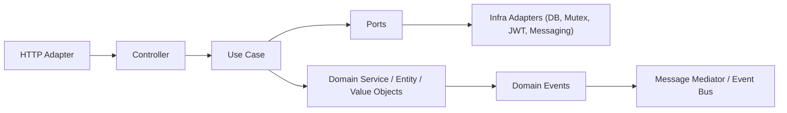

# AnyWhere, AnyHow, AnyTime - TypeScript Boilerplate

[](https://dl.circleci.com/status-badge/redirect/gh/web2solutions/aaa-typescript-boilerplate/tree/dev)
[](https://codecov.io/gh/web2solutions/aaa-typescript-boilerplate)
[](https://sonarcloud.io/summary/new_code?id=web2solutions_aaa-typescript-boilerplate)
[](https://sonarcloud.io/summary/new_code?id=web2solutions_aaa-typescript-boilerplate)
[](https://snyk.io/test/github/web2solutions/aaa-typescript-boilerplate)
[](https://nodejs.org/)
[](./spec/1.0.0.yml)
[](./spec)
[](./LICENSE)
[](https://github.com/web2solutions/aaa-typescript-boilerplate/commits/dev)

| Security scan status | Tests in Main | Tests in Dev | Coverage in Main | Coverage in Dev |
|----------------------|:-------------:|:------------:|:----------------:|----------------:|
| [](https://snyk.io/test/github/web2solutions/aaa-typescript-boilerplate) | [](https://dl.circleci.com/status-badge/redirect/gh/web2solutions/aaa-typescript-boilerplate/tree/main) | [](https://dl.circleci.com/status-badge/redirect/gh/web2solutions/aaa-typescript-boilerplate/tree/dev) | [](https://codecov.io/gh/web2solutions/aaa-typescript-boilerplate) | [](https://codecov.io/gh/web2solutions/aaa-typescript-boilerplate) |

[](https://expressjs.com/)
[](https://fastify.dev/)
[](http://restify.com/)
[](https://github.com/kartikk221/hyper-express)
[](https://www.serverless.com/)

[](https://sonarcloud.io/summary/new_code?id=web2solutions_aaa-typescript-boilerplate)
[](https://sonarcloud.io/summary/new_code?id=web2solutions_aaa-typescript-boilerplate)
[](https://sonarcloud.io/summary/new_code?id=web2solutions_aaa-typescript-boilerplate)


[](http://commitizen.github.io/cz-cli/)

[](https://vshymanskyy.github.io/StandWithUkraine)
[](https://gitpod.io/#https://github.com/web2solutions/aaa-typescript-boilerplate)

Build production-grade backend products faster, with clear architecture, strict quality gates, and runtime freedom.

This project is a feature-driven backend boilerplate for teams that want speed without losing long-term maintainability. It supports monolithic modular systems, microservice-ready composition, and lambda/serverless execution using the same core business logic.

## Why Teams Choose This Boilerplate

### 1) Faster Time to Market
- Core architecture is already structured (DDD + Hexagonal + Event-Driven).
- You start from real domain boundaries, not from generic folders.
- CI quality gates are pre-wired.

### 2) Lower Refactor Cost Over Time
- Business rules are isolated from HTTP frameworks.
- You can switch transport/runtime adapters without rewriting domain/application layers.
- Contract-based message mediator reduces coupling between domains.

### 3) Better Delivery Predictability
- Built-in guardrails for lint, tests, route resolution, architecture boundaries, and coverage threshold.
- Coverage policy is enforced as a release discipline.
- Runtime and docs are aligned by project requirements and agents.

### 4) Compliance-Ready by Design (PCI-Focused)
- Security controls are embedded in day-to-day engineering flow, not postponed to release week.
- RBAC and tenant scope checks are enforced at controller boundaries.
- Sensitive error exposure is environment-aware (`dev/staging` visible, `production` masked).
- Security smoke checks run inside CI gate, alongside lint/build/test.
- Audit-oriented documentation and evidence mapping are already part of the repository.

## What You Can Build

- REST APIs with multiple Node.js HTTP frameworks
- Modular monoliths ready to split into microservices
- AWS Lambda handlers from the same domain/application composition
- Contract-based domain communication (in-memory, RabbitMQ, BullMQ)
- Developer automation workflows through the CLI sub-apps

## Available Node.js Web/HTTP Integrations

The project already includes adapters and entrypoints for:

1. Express
2. Fastify
3. Restify
4. Hyper-Express
5. AWS Lambda (Serverless Framework)
6. Cloudflare Workers style adapter (serverless `fetch`)
7. Vercel Functions style adapter (`req`/`res`)
8. LoopBack runtime adapter
9. Sails.js runtime adapter
10. Feathers runtime adapter
11. Derby.js runtime adapter
12. Adonis.js runtime bridge
13. Total.js runtime bridge

## Integration Commands

Run any adapter in development:

```bash
npm run dev:express
npm run dev:fastify
npm run dev:restify
npm run dev:hyper-express
npm run dev:cloudflare-workers
npm run dev:vercel-functions
npm run dev:loopback
npm run dev:sails-js
npm run dev:feathers
npm run dev:derby-js
npm run dev:adonis-js
npm run dev:total-js
npm run dev:serverless
```

Production equivalents are also available (`prod:*` scripts).

## Product and Engineering Benefits

### For Product Owners
- Faster feature delivery with reduced architectural risk.
- Better roadmap confidence from enforced quality checks.
- Easier scaling from MVP to multi-runtime deployment strategies.
- Lower compliance risk during growth phases with a baseline mapped to PCI-oriented controls.

### For Software Engineers
- Clear layer ownership:
  - Domain
  - Use Cases
  - Ports
  - Adapters
  - Controllers/Handlers
- Contract-driven integration over direct cross-domain dependency.
- Stable patterns for adding features with minimum blast radius.
- Multi-tenancy ready by default with role-aware organization boundaries.
- Data-entity ownership is explicit: each entity has its own controller contract and boundary.

## PCI Compliance Positioning

This boilerplate is not marketed as “PCI certified by default”, but it gives teams a practical head start toward PCI-aligned implementation and audit readiness:

- Authorization and tenant boundaries are test-covered.
- Error payload behavior is controlled by environment with production masking.
- Security runbooks and evidence references are versioned with source code.
- CI includes security smoke checks to prevent regressions from reaching pull requests.

For teams building payment-adjacent platforms, this reduces rework and creates an auditable engineering trail from day one.

## Architecture at a Glance


```mermaid
flowchart LR
  A["HTTP Adapter"] --> B["Controller"]
  B --> C["Use Case"]
  C --> D["Domain Service / Entity / Value Objects"]
  C --> E["Ports"]
  E --> F["Infra Adapters (DB, Mutex, JWT, Messaging)"]
  D --> G["Domain Events"]
  G --> H["Message Mediator / Event Bus"]
```

## Message Mediator (Contract-Based)

Domains communicate through contracts, not direct service coupling.

Supported adapters:
- `inmemory` (default)
- `rabbitmq`
- `bullmq`

Select adapter by environment:

```bash
AAA_MESSAGE_MEDIATOR_ADAPTER=inmemory
# or
AAA_MESSAGE_MEDIATOR_ADAPTER=rabbitmq
# or
AAA_MESSAGE_MEDIATOR_ADAPTER=bullmq
```

## Code Example: Register a Contract Handler

```ts
messageMediator.registerHandler(
  "users.auth.ensure-access",
  async (message) => {
    const user = await authService.authorize(message.payload.authorization);
    authService.throwIfUserHasNoAccessToResource(user, message.payload.schemaOAS);
    return {
      contract: message.contract,
      version: message.version,
      result: user
    };
  }
);
```

## Code Example: Request/Response Without Tight Coupling

```ts
const response = await messageMediator.request({
  contract: "users.auth.ensure-access",
  payload: {
    authorization: event.authorization,
    schemaOAS: event.schemaOAS
  }
});

if (response.error) {
  throw response.error;
}
```

## Tenancy and RBAC

Tenancy modes supported:
- Single-tenancy: users without organization linkage (commonly `superadmin` operations).
- Multi-tenancy: organization-scoped users (`admin`, `user`) with organization-level access boundaries.

Default RBAC roles:
- `superadmin`
- `admin`
- `user`

Tenancy rule:
- `admin` and `user` must belong to an `Organization`.
- `superadmin` can operate across organizations.

## Code Example: Framework Runtime Bootstrap

```ts
const serverType = EHTTPFrameworks.fastify;
const webServer = FastifyServer.compile();
const messageMediator = compileMessageMediator();

const API = new RestAPI({
  databaseClient: InMemoryDbClient,
  webServer,
  serverType,
  infraHandlers,
  eventBus: messageMediator,
  messageMediator
});

await API.start();
await API.seedData();
```

## Quick Start

```bash
npm install
npm run cli:bootstrap
npm run docker:composeredis
npm run docker:composerabbit
npm run docker:compose:platform-services
npm run docker:compose:service-template
npm run ci:gate
npm run dev
```

API docs after startup:
- UI: `http://localhost:3000/OASdoc/`
- JSON: `http://localhost:3000/docs/1.0.0`
- AsyncAPI UI: `http://localhost:3000/AsyncAPIdoc/`
- AsyncAPI JSON index: `http://localhost:3000/docs/asyncapi/versions`

For VM profiles, runtime services are orchestrated with PM2.
`WebSocketAPI + RESTAPI` and `gRPCAPI + RESTAPI` run as separated processes and ports.
Service Management (`servicemangement`) is also served via PM2.
Runtime adapter startup is controlled by:

```bash
AAA_HTTP_FRAMEWORK=express
AAA_REALTIME_API=no
AAA_REALTIME_API_PROTOCOL=websocket
AAA_REALTIME_API_DATABASE_DRIVER=Mongo
```

Official startup entrypoints:
- `src/interface/HTTP/adapters/start-rest-api.ts`
- `src/interface/WebSocket/adapters/start-websocket-api.ts`
- `src/interface/gRPC/adapters/start-grpc-api.ts`

Service Management runtime env API:
- `GET /api/runtime/env?environment=dev|staging|ci`
- `POST /api/runtime/env`

## Quality Gate and CI Discipline

This project is designed to block risky changes before merge:
- lint
- unit tests
- architecture checks
- OpenAPI route resolution checks
- build check
- smoke integration
- coverage threshold policy

## Service Docker Templates

Service Dockerfiles are available under:

- `docker/services/Dockerfile.rest`
- `docker/services/Dockerfile.websocket`
- `docker/services/Dockerfile.grpc`
- `docker/services/Dockerfile.graphql`
- `docker/services/Dockerfile.functions`

Compose template:

- `docker-compose-service-templates.yml`

## Documentation Index

| Nature | Document | Description |
|--------|----------|-------------|
| Product Context | [Project Overview](documentation/md/PROJECT-OVERVIEW.md) | Purpose, use cases, acceleration strategy, and product value. |
| Architecture | [Architecture and Structure](documentation/md/ARCHITECTURE-AND-STRUCTURE.md) | Folder structure, boundaries, and layer responsibilities. |
| Runtime and Ops | [Setup, Runtime, and API](documentation/md/SETUP-RUNTIME-AND-API.md) | Setup, commands, runtime adapters, and API docs endpoints. |
| Runtime Contract | [Runtime Environment Contracts](documentation/md/RUNTIME-ENVIRONMENT-CONTRACTS.md) | Canonical env keys, startup entrypoints, PM2 process model, and Service Management env API. |
| Integration Contracts | [Events and Messages Map](documentation/md/EVENTS-AND-MESSAGES-MAP.md) | Event and mediator contract map. |
| Error Contracts | [Error Contracts and Responses](documentation/md/ERROR-CONTRACTS-AND-RESPONSES.md) | Error codes, mapping, and HTTP response contracts. |
| Quality | [Testing, CI, and Quality](documentation/md/TESTING-CI-AND-QUALITY.md) | Test strategy, CI gate, coverage policy, Sonar/Codecov. |
| Tooling | [Contributing and Tooling](documentation/md/CONTRIBUTING-AND-TOOLING.md) | Development workflow and commands. |
| Dependencies | [Dependencies](documentation/md/DEPENDENCIES.md) | Runtime and infrastructure dependencies. |
| Domain Entities | [Domain Data Entities](documentation/md/DOMAIN-DATA-ENTITIES.md) | Data entity catalog and field contracts. |
| Developer CLI | [Developer Automation CLI](documentation/md/DEVELOPER-AUTOMATION-CLI.md) | CLI wrapper and sub-app workflows. |
| Bootstrap CLI | [Bootstrap CLI Scaffolding](documentation/md/BOOTSTRAP-CLI-SCAFFOLDING.md) | Installable scaffold command to clone and configure new projects. |
| Service Management | [Service Management App](servicemangement/README.md) | Tabbed suite for domain design, communication interfaces, service configuration, and deploy management. |
| Domain Designer Guide | [Domain Designer Features and Usage](documentation/md/DOMAIN-DESIGNER-FEATURES-AND-USAGE.md) | Technical usage guide for all Domain Designer MVP features and exports/imports. |
| External Adapters | [External Data Adapter Foundations](documentation/md/EXTERNAL-DATA-ADAPTER-FOUNDATIONS.md) | SQL/NoSQL repository foundations and queue request-response adapter. |
| Database Validation | [Database Drivers Smoke Tests](documentation/md/DATABASE-DRIVERS-SMOKE-TESTS.md) | Driver matrix, per-database Docker compose, and smoke execution commands. |
| Security Compliance | [PCI Remediation Plan and Evidence](documentation/md/PCI-REMEDIATION-PLAN-AND-EVIDENCE.md) | Sprint-based remediation plan (P0/P1/P2) and audit evidence checklist. |
| Security Operations | [Security Runbook (PCI)](documentation/md/SECURITY-RUNBOOK-PCI.md) | Key rotation, incident response, retention and audit export procedures. |
| Domain Designer Roadmap | [Domain Designer MVP Roadmap](documentation/md/DOMAIN-DESIGNER-MVP-ROADMAP.md) | MVP status, delivered increments, and next priorities. |
| Project Management | [Project Management](documentation/md/PROJECT-MANAGEMENT.md) | Backlog references, requirement tracking, and governance links. |
| Agents Registry | [.agents/README.md](.agents/README.md) | Technical requirements and specialized agents. |

## Additional Detailed Documents

- [Engineering Bootstrap Guide](documentation/md/ENGINEERING-BOOTSTRAP-GUIDE.md)
- [Hexagonal Feature-driven Migration Plan](documentation/md/HEXAGONAL-FEATURE-DRIVEN-MIGRATION.md)
- [Users Domain Model](documentation/md/domains/users/USER-MODEL.md)
- [Users Entity Contract](documentation/md/domains/users/USER-ENTITY-CONTRACT.md)
- [Users Value Objects](documentation/md/domains/users/USER-VALUE-OBJECTS.md)
- [Users Organization Model](documentation/md/domains/users/ORGANIZATION-MODEL.md)
- [CI Troubleshooting](documentation/md/CI-TROUBLESHOOTING.md)
- [Service Management Application](documentation/md/SERVICE-MANAGEMENT-APPLICATION.md)
- [Domain Designer Features and Usage](documentation/md/DOMAIN-DESIGNER-FEATURES-AND-USAGE.md)
- [Security Runbook (PCI)](documentation/md/SECURITY-RUNBOOK-PCI.md)

---

If you need high delivery speed, multi-runtime flexibility, and architecture control without framework lock-in, this boilerplate is built for your team.
