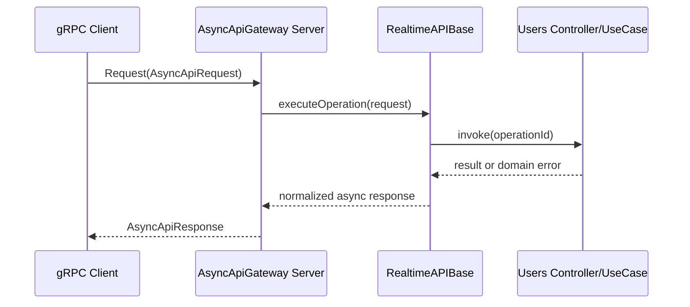

# gRPC Realtime API

This guide is exclusively for the gRPC realtime interface.

## Scope

- Transport: gRPC
- Server implementation: `src/interface/gRPC/gRPCAPI.ts`
- Proto contract: `src/interface/gRPC/proto/async-api.proto`
- SDK client: `sdk-clients/grpc/GrpcApiClient.ts`
- AsyncAPI source: `spec/asyncapi/1.0.0.grpc.yml`

## Contract References

- [gRPC Realtime Contracts](../../contracts/GRPC-REALTIME-CONTRACTS.md)
- [Error Contracts and Responses](../../ERROR-CONTRACTS-AND-RESPONSES.md)
- [Events and Messages Map](../../EVENTS-AND-MESSAGES-MAP.md)

## Service Contract

- Service name: `realtime.AsyncApiGateway`
- RPC methods:
  - `Request(AsyncApiRequest) returns (AsyncApiResponse)` (unary)
  - `Exchange(stream AsyncApiRequest) returns (stream AsyncApiResponse)` (bi-directional stream)

## Runtime Flow



## Deep Example: Unary Request

```ts
import { GrpcApiClient } from '../sdk-clients/grpc/GrpcApiClient';

const client = new GrpcApiClient('localhost:3002');

const response = await client.request({
  version: '1.0.0',
  operationId: 'createOrganization',
  authorization: 'Bearer <jwt>',
  input: {
    name: 'Acme Group',
    address: [],
    phone: [],
    email: []
  },
  metadata: {
    requestId: 'req-grpc-001',
    correlationId: 'corr-tenant-42'
  }
});

if (!response.ok) {
  console.error(response.error);
} else {
  console.log(response.result);
}
```

## Deep Example: Native gRPC Bi-directional Stream

```ts
import path from 'path';
import grpc from '@grpc/grpc-js';
import protoLoader from '@grpc/proto-loader';

const protoPath = path.resolve(process.cwd(), 'src/interface/gRPC/proto/async-api.proto');
const packageDefinition = protoLoader.loadSync(protoPath, {
  longs: String,
  enums: String,
  defaults: true,
  oneofs: true
});
const grpcObject = grpc.loadPackageDefinition(packageDefinition) as any;
const client = new grpcObject.realtime.AsyncApiGateway(
  'localhost:3002',
  grpc.credentials.createInsecure()
);

const stream = client.exchange();

stream.on('data', (msg: any) => {
  const result = msg.resultJson ? JSON.parse(msg.resultJson) : null;
  console.log('stream response', msg.operationId, result, msg.errorMessage);
});

stream.on('error', (err: Error) => {
  console.error('stream error', err);
});

stream.write({
  version: '1.0.0',
  operationId: 'getAllOrganizations',
  authorization: 'Bearer <jwt>',
  inputJson: JSON.stringify({}),
  paramsJson: JSON.stringify({}),
  queryStringJson: JSON.stringify({ page: 1, size: 20 }),
  metadataJson: JSON.stringify({ requestId: 'stream-1' })
});

stream.end();
```

## Payload Serialization Rules

1. Transport fields `inputJson`, `paramsJson`, `queryStringJson`, `metadataJson` are JSON strings.
2. Server maps transport payload into the internal async request envelope.
3. `resultJson` in response must be parsed by client consumers.
4. `errorName` and `errorMessage` provide normalized failure metadata.

## Operational Guidance

1. Keep one client per service host/port for connection reuse.
2. Prefer unary RPC for independent operations.
3. Use stream exchange for high-frequency operation batches.
4. Enforce per-request correlation with `metadataJson.requestId`.
