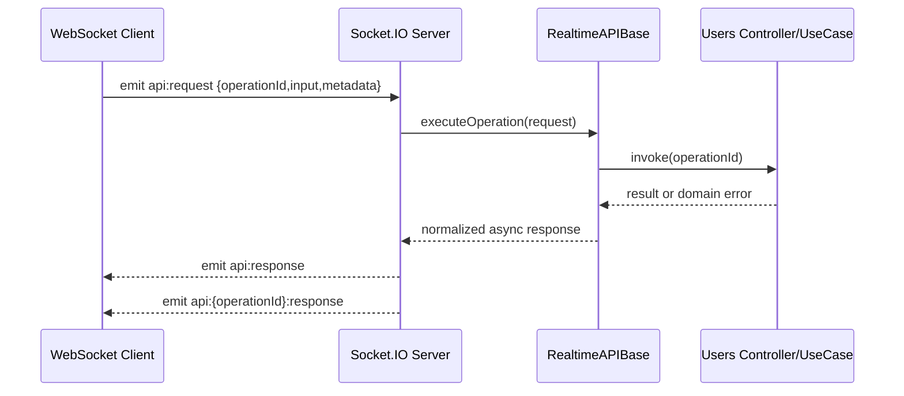

# WebSocket Realtime API

This guide is exclusively for the Socket.IO realtime interface.

## Scope

- Transport: WebSocket (Socket.IO protocol)
- Server implementation: `src/interface/WebSocket/WebSocketAPI.ts`
- SDK client: `sdk-clients/websocket/WebSocketApiClient.ts`
- AsyncAPI source: `spec/asyncapi/1.0.0.websocket.yml`

## Contract References

- [WebSocket Realtime Contracts](../../contracts/WEBSOCKET-REALTIME-CONTRACTS.md)
- [Error Contracts and Responses](../../ERROR-CONTRACTS-AND-RESPONSES.md)
- [Events and Messages Map](../../EVENTS-AND-MESSAGES-MAP.md)

## Endpoint and Channels

- Base URL: `ws://localhost:3001`
- Socket.IO path: `/ws`
- Generic request channel: `api:request`
- Generic response channel: `api:response`
- Per-operation request: `api:{operationId}:request`
- Per-operation response: `api:{operationId}:response`

## Horizontal Scaling with Redis Streams Adapter

To run multiple Socket.IO servers with consistent cross-node delivery, enable Redis Streams adapter:

```bash
AAA_WEBSOCKET_SOCKETIO_ADAPTER=redis-streams
AAA_WEBSOCKET_REDIS_URL=redis://127.0.0.1:6379/1
```

Fallback resolution order for Redis connection:

1. `AAA_WEBSOCKET_REDIS_URL`
2. `AAA_REDIS_URL`
3. `AAA_REDIS_HOST` + `AAA_REDIS_PORT` + `AAA_REDIS_DATABASE` (+ `AAA_REDIS_PASSWORD`)

Implementation files:

- `src/interface/WebSocket/adapters/socket-io/redisStreamsAdapter.ts`
- `src/interface/WebSocket/adapters/socket-io/socket-io.ts`

## Multi-thread Resilience with Socket.IO Cluster Adapter

To scale across CPU workers (multiple Node.js threads/processes in the same host), enable:

```bash
AAA_WEBSOCKET_SOCKETIO_ADAPTER=cluster
AAA_WEBSOCKET_CLUSTER_WORKERS=4
```

Implementation files:

- `src/interface/WebSocket/adapters/socket-io/clusterAdapter.ts`
- `src/interface/WebSocket/adapters/start-websocket-api.ts`
- `src/interface/WebSocket/adapters/socket-io/socket-io.ts`

Notes:

1. Primary process forks workers and restarts dead workers automatically.
2. Worker processes host Socket.IO and share events via `@socket.io/cluster-adapter`.
3. For multi-host deployments, prefer Redis Streams adapter.

## Multi-instance Validation Test

A dedicated integration test validates resilience with 2 Socket.IO servers + Redis:

- `test/integration/realtime/socketio.redis-streams.multi-instance.test.ts`

Run it with Docker:

```bash
npm run smoke:realtime:redis-streams
```

Or run only the test (requires Redis running):

```bash
npm run test:integration:realtime:redis-streams
```

## Runtime Flow



## Deep Example: Generic Request + ACK correlation

```ts
import { io } from 'socket.io-client';
import { randomUUID } from 'crypto';

const socket = io('ws://localhost:3001', {
  path: '/ws',
  transports: ['websocket']
});

await new Promise<void>((resolve) => socket.on('connect', () => resolve()));

const requestId = randomUUID();
const channel = 'api:createOrganization:response';

socket.on(channel, (payload) => {
  if (payload?.metadata?.requestId !== requestId) return;
  console.log('Operation channel response:', payload);
});

socket.timeout(30000).emit(
  'api:request',
  {
    version: '1.0.0',
    operationId: 'createOrganization',
    authorization: 'Bearer <jwt>',
    input: {
      name: 'Acme Group',
      address: [],
      phone: [],
      email: []
    },
    metadata: { requestId }
  },
  (ackPayload) => {
    console.log('ACK response:', ackPayload);
  }
);
```

## Deep Example: Per-operation Channel Request

```ts
import { io } from 'socket.io-client';

const socket = io('ws://localhost:3001', {
  path: '/ws',
  transports: ['websocket']
});

await new Promise<void>((resolve) => socket.on('connect', () => resolve()));

socket.emit(
  'api:getAllOrganizations:request',
  {
    version: '1.0.0',
    authorization: 'Bearer <jwt>',
    queryString: { page: 1, size: 20 },
    metadata: { requestId: 'req-001' }
  },
  (response) => {
    if (!response.ok) {
      console.error(response.error);
      return;
    }
    console.log(response.result);
  }
);
```

## SDK Example

```ts
import { WebSocketApiClient } from '../sdk-clients/websocket/WebSocketApiClient';

const client = new WebSocketApiClient('ws://localhost:3001');
client.connect();

const response = await client.request({
  version: '1.0.0',
  operationId: 'getAllOrganizations',
  authorization: 'Bearer <jwt>',
  queryString: { page: 1, size: 10 },
  metadata: { requestId: 'req-ws-01' }
});

console.log(response.result);
client.disconnect();
```

## Response/Error Handling Rules

1. `ok=true` means `result` is the response payload for the `operationId`.
2. `ok=false` means `error` contains normalized error data.
3. `metadata.requestId` is the correlation key to match client requests.
4. `metadata.channel` contains the response channel used by the server.

## Operational Guidance

1. Always send `metadata.requestId` from the client.
2. Subscribe to both `api:response` and `api:{operationId}:response` when building generic clients.
3. Keep a client-side timeout and retry strategy for transient network failures.
